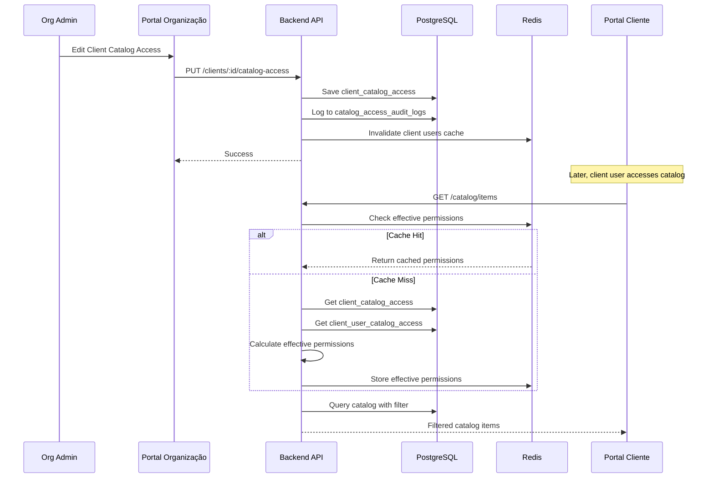

# Design Document: Catalog Access Control

## Overview

Este documento descreve o design técnico para o sistema de controlo de acesso ao catálogo de serviços. O sistema permite que organizações definam quais categorias e itens do catálogo estão disponíveis para cada cliente e utilizador, suportando diferentes pacotes de serviços por cliente.

### Arquitetura de Alto Nível

```
┌─────────────────────────────────────────────────────────────────┐
│                    Portal da Organização                         │
│  ┌─────────────────┐  ┌─────────────────┐  ┌─────────────────┐  │
│  │  Client Edit    │  │  User Edit      │  │  Catalog Mgmt   │  │
│  │  + Catalog Tab  │  │  + Catalog Tab  │  │                 │  │
│  └────────┬────────┘  └────────┬────────┘  └─────────────────┘  │
└───────────┼────────────────────┼────────────────────────────────┘
            │                    │
            ▼                    ▼
┌─────────────────────────────────────────────────────────────────┐
│                         Backend API                              │
│  ┌─────────────────────────────────────────────────────────────┐│
│  │              CatalogAccessService                            ││
│  │  - getClientAccess()      - getUserAccess()                  ││
│  │  - setClientAccess()      - setUserAccess()                  ││
│  │  - getEffectiveAccess()   - filterCatalog()                  ││
│  └─────────────────────────────────────────────────────────────┘│
│  ┌─────────────────────────────────────────────────────────────┐│
│  │              CatalogAccessCache (Redis)                      ││
│  │  - cacheEffectiveAccess() - invalidateCache()                ││
│  └─────────────────────────────────────────────────────────────┘│
└─────────────────────────────────────────────────────────────────┘
            │
            ▼
┌─────────────────────────────────────────────────────────────────┐
│                        PostgreSQL                                │
│  ┌──────────────────┐  ┌──────────────────┐  ┌────────────────┐ │
│  │client_catalog_   │  │client_user_      │  │catalog_access_ │ │
│  │access            │  │catalog_access    │  │audit_logs      │ │
│  └──────────────────┘  └──────────────────┘  └────────────────┘ │
└─────────────────────────────────────────────────────────────────┘
            │
            ▼
┌─────────────────────────────────────────────────────────────────┐
│                    Portal Cliente Empresa                        │
│  ┌─────────────────────────────────────────────────────────────┐│
│  │              Service Catalog (Filtered)                      ││
│  │  - Only shows permitted categories/items                     ││
│  │  - Search filtered by permissions                            ││
│  └─────────────────────────────────────────────────────────────┘│
└─────────────────────────────────────────────────────────────────┘
```

## Architecture

### Componentes Principais

1. **CatalogAccessService** - Serviço central para gestão de permissões
2. **CatalogAccessCache** - Cache Redis para permissões efetivas
3. **CatalogAccessController** - Endpoints REST para gestão
4. **CatalogAccessAudit** - Sistema de auditoria de alterações

### Fluxo de Dados



## Components and Interfaces

### 1. CatalogAccessService

```javascript
class CatalogAccessService {
  /**
   * Get catalog access rules for a client
   * @param {string} clientId - Client UUID
   * @returns {CatalogAccessRules} Access rules
   */
  async getClientAccess(clientId) {}

  /**
   * Set catalog access rules for a client
   * @param {string} clientId - Client UUID
   * @param {CatalogAccessRules} rules - New access rules
   * @param {string} modifiedBy - User who made the change
   */
  async setClientAccess(clientId, rules, modifiedBy) {}

  /**
   * Get catalog access rules for a client user
   * @param {string} clientUserId - Client User UUID
   * @returns {ClientUserCatalogAccess} Access rules with inheritance mode
   */
  async getUserAccess(clientUserId) {}

  /**
   * Set catalog access rules for a client user
   * @param {string} clientUserId - Client User UUID
   * @param {ClientUserCatalogAccess} rules - New access rules
   * @param {string} modifiedBy - User who made the change
   */
  async setUserAccess(clientUserId, rules, modifiedBy) {}

  /**
   * Calculate effective permissions for a client user
   * @param {string} clientUserId - Client User UUID
   * @returns {EffectiveAccess} Resolved permissions
   */
  async getEffectiveAccess(clientUserId) {}

  /**
   * Filter catalog items based on user permissions
   * @param {string} clientUserId - Client User UUID
   * @param {CatalogQuery} query - Search/filter parameters
   * @returns {CatalogItem[]} Filtered items
   */
  async filterCatalog(clientUserId, query) {}

  /**
   * Check if user has access to specific item
   * @param {string} clientUserId - Client User UUID
   * @param {string} itemId - Catalog Item UUID
   * @returns {boolean} Has access
   */
  async hasAccessToItem(clientUserId, itemId) {}
}
```

### 2. API Endpoints

```
GET  /api/clients/:id/catalog-access
PUT  /api/clients/:id/catalog-access
GET  /api/client-users/:id/catalog-access
PUT  /api/client-users/:id/catalog-access
GET  /api/catalog/effective-access
GET  /api/catalog/access-audit/:entityType/:entityId
```

### 3. Frontend Components

```
CatalogAccessTab
├── CatalogAccessModeSelector (all/selected/none)
├── CatalogTreeSelector
│   ├── CategoryNode (with checkbox)
│   │   ├── SubcategoryNode
│   │   └── ItemNode
│   └── SearchFilter
├── SelectedItemsSummary
└── InheritanceModeSelector (for users only)
```

## Data Models

### ClientCatalogAccess Model

```javascript
const ClientCatalogAccess = sequelize.define('ClientCatalogAccess', {
  id: {
    type: DataTypes.UUID,
    defaultValue: DataTypes.UUIDV4,
    primaryKey: true
  },
  organizationId: {
    type: DataTypes.UUID,
    allowNull: false,
    references: { model: 'organizations', key: 'id' }
  },
  clientId: {
    type: DataTypes.UUID,
    allowNull: false,
    unique: true,
    references: { model: 'clients', key: 'id' }
  },
  // Access mode: 'all' | 'selected' | 'none'
  accessMode: {
    type: DataTypes.ENUM('all', 'selected', 'none'),
    defaultValue: 'all'
  },
  // Array of allowed category IDs (when mode is 'selected')
  allowedCategories: {
    type: DataTypes.ARRAY(DataTypes.UUID),
    defaultValue: []
  },
  // Array of allowed item IDs (when mode is 'selected')
  allowedItems: {
    type: DataTypes.ARRAY(DataTypes.UUID),
    defaultValue: []
  },
  // Array of explicitly denied category IDs (blacklist)
  deniedCategories: {
    type: DataTypes.ARRAY(DataTypes.UUID),
    defaultValue: []
  },
  // Array of explicitly denied item IDs (blacklist)
  deniedItems: {
    type: DataTypes.ARRAY(DataTypes.UUID),
    defaultValue: []
  },
  // Last modified info
  modifiedBy: {
    type: DataTypes.UUID,
    allowNull: true,
    references: { model: 'organization_users', key: 'id' }
  }
}, {
  tableName: 'client_catalog_access',
  timestamps: true,
  indexes: [
    { fields: ['organization_id'] },
    { fields: ['client_id'], unique: true }
  ]
});
```

### ClientUserCatalogAccess Model

```javascript
const ClientUserCatalogAccess = sequelize.define('ClientUserCatalogAccess', {
  id: {
    type: DataTypes.UUID,
    defaultValue: DataTypes.UUIDV4,
    primaryKey: true
  },
  organizationId: {
    type: DataTypes.UUID,
    allowNull: false,
    references: { model: 'organizations', key: 'id' }
  },
  clientUserId: {
    type: DataTypes.UUID,
    allowNull: false,
    unique: true,
    references: { model: 'client_users', key: 'id' }
  },
  clientId: {
    type: DataTypes.UUID,
    allowNull: false,
    references: { model: 'clients', key: 'id' }
  },
  // Inheritance mode: 'inherit' | 'override' | 'extend'
  inheritanceMode: {
    type: DataTypes.ENUM('inherit', 'override', 'extend'),
    defaultValue: 'inherit'
  },
  // Access mode (only used when inheritanceMode is 'override')
  accessMode: {
    type: DataTypes.ENUM('all', 'selected', 'none'),
    defaultValue: 'all'
  },
  // Arrays for user-specific permissions
  allowedCategories: {
    type: DataTypes.ARRAY(DataTypes.UUID),
    defaultValue: []
  },
  allowedItems: {
    type: DataTypes.ARRAY(DataTypes.UUID),
    defaultValue: []
  },
  deniedCategories: {
    type: DataTypes.ARRAY(DataTypes.UUID),
    defaultValue: []
  },
  deniedItems: {
    type: DataTypes.ARRAY(DataTypes.UUID),
    defaultValue: []
  },
  modifiedBy: {
    type: DataTypes.UUID,
    allowNull: true,
    references: { model: 'organization_users', key: 'id' }
  }
}, {
  tableName: 'client_user_catalog_access',
  timestamps: true,
  indexes: [
    { fields: ['organization_id'] },
    { fields: ['client_id'] },
    { fields: ['client_user_id'], unique: true }
  ]
});
```

### CatalogAccessAuditLog Model

```javascript
const CatalogAccessAuditLog = sequelize.define('CatalogAccessAuditLog', {
  id: {
    type: DataTypes.UUID,
    defaultValue: DataTypes.UUIDV4,
    primaryKey: true
  },
  organizationId: {
    type: DataTypes.UUID,
    allowNull: false
  },
  // Entity type: 'client' | 'client_user'
  entityType: {
    type: DataTypes.ENUM('client', 'client_user'),
    allowNull: false
  },
  entityId: {
    type: DataTypes.UUID,
    allowNull: false
  },
  // Action: 'create' | 'update' | 'delete'
  action: {
    type: DataTypes.ENUM('create', 'update', 'delete'),
    allowNull: false
  },
  // Previous state (JSON)
  previousState: {
    type: DataTypes.JSONB,
    allowNull: true
  },
  // New state (JSON)
  newState: {
    type: DataTypes.JSONB,
    allowNull: true
  },
  // Who made the change
  changedBy: {
    type: DataTypes.UUID,
    allowNull: false
  },
  changedByName: {
    type: DataTypes.STRING,
    allowNull: true
  },
  // IP address for security
  ipAddress: {
    type: DataTypes.STRING,
    allowNull: true
  }
}, {
  tableName: 'catalog_access_audit_logs',
  timestamps: true,
  updatedAt: false,
  indexes: [
    { fields: ['organization_id'] },
    { fields: ['entity_type', 'entity_id'] },
    { fields: ['created_at'] }
  ]
});
```

### Database Schema (SQL)

```sql
-- Client Catalog Access
CREATE TABLE client_catalog_access (
    id UUID PRIMARY KEY DEFAULT gen_random_uuid(),
    organization_id UUID NOT NULL REFERENCES organizations(id) ON DELETE CASCADE,
    client_id UUID NOT NULL UNIQUE REFERENCES clients(id) ON DELETE CASCADE,
    access_mode VARCHAR(20) DEFAULT 'all' CHECK (access_mode IN ('all', 'selected', 'none')),
    allowed_categories UUID[] DEFAULT '{}',
    allowed_items UUID[] DEFAULT '{}',
    denied_categories UUID[] DEFAULT '{}',
    denied_items UUID[] DEFAULT '{}',
    modified_by UUID REFERENCES organization_users(id),
    created_at TIMESTAMP WITH TIME ZONE DEFAULT NOW(),
    updated_at TIMESTAMP WITH TIME ZONE DEFAULT NOW()
);

-- Client User Catalog Access
CREATE TABLE client_user_catalog_access (
    id UUID PRIMARY KEY DEFAULT gen_random_uuid(),
    organization_id UUID NOT NULL REFERENCES organizations(id) ON DELETE CASCADE,
    client_user_id UUID NOT NULL UNIQUE REFERENCES client_users(id) ON DELETE CASCADE,
    client_id UUID NOT NULL REFERENCES clients(id) ON DELETE CASCADE,
    inheritance_mode VARCHAR(20) DEFAULT 'inherit' CHECK (inheritance_mode IN ('inherit', 'override', 'extend')),
    access_mode VARCHAR(20) DEFAULT 'all' CHECK (access_mode IN ('all', 'selected', 'none')),
    allowed_categories UUID[] DEFAULT '{}',
    allowed_items UUID[] DEFAULT '{}',
    denied_categories UUID[] DEFAULT '{}',
    denied_items UUID[] DEFAULT '{}',
    modified_by UUID REFERENCES organization_users(id),
    created_at TIMESTAMP WITH TIME ZONE DEFAULT NOW(),
    updated_at TIMESTAMP WITH TIME ZONE DEFAULT NOW()
);

-- Audit Logs
CREATE TABLE catalog_access_audit_logs (
    id UUID PRIMARY KEY DEFAULT gen_random_uuid(),
    organization_id UUID NOT NULL,
    entity_type VARCHAR(20) NOT NULL CHECK (entity_type IN ('client', 'client_user')),
    entity_id UUID NOT NULL,
    action VARCHAR(20) NOT NULL CHECK (action IN ('create', 'update', 'delete')),
    previous_state JSONB,
    new_state JSONB,
    changed_by UUID NOT NULL,
    changed_by_name VARCHAR(255),
    ip_address VARCHAR(45),
    created_at TIMESTAMP WITH TIME ZONE DEFAULT NOW()
);

-- Indexes
CREATE INDEX idx_client_catalog_access_org ON client_catalog_access(organization_id);
CREATE INDEX idx_client_user_catalog_access_org ON client_user_catalog_access(organization_id);
CREATE INDEX idx_client_user_catalog_access_client ON client_user_catalog_access(client_id);
CREATE INDEX idx_catalog_access_audit_entity ON catalog_access_audit_logs(entity_type, entity_id);
CREATE INDEX idx_catalog_access_audit_date ON catalog_access_audit_logs(created_at);
```

## Correctness Properties

*A property is a characteristic or behavior that should hold true across all valid executions of a system—essentially, a formal statement about what the system should do. Properties serve as the bridge between human-readable specifications and machine-verifiable correctness guarantees.*

### Property 1: Default Access Grants All Public Items

*For any* client without specific access rules (no ClientCatalogAccess record or accessMode='all'), querying the catalog should return all public catalog items for that organization.

**Validates: Requirements 1.3**

### Property 2: Filtered Access Returns Only Permitted Items

*For any* client with accessMode='selected' and any catalog query, all returned items must be in the allowedItems array OR belong to a category in allowedCategories, AND must not be in deniedItems or deniedCategories.

**Validates: Requirements 1.4, 4.1, 4.2**

### Property 3: Access Modes Behave Correctly

*For any* client:
- If accessMode='all': all public items are accessible (minus denied)
- If accessMode='selected': only allowed items/categories are accessible
- If accessMode='none': no items are accessible

**Validates: Requirements 1.5**

### Property 4: Effective Permissions Calculation

*For any* client user:
- If inheritanceMode='inherit': effective permissions equal client permissions
- If inheritanceMode='override': effective permissions equal user-specific permissions
- If inheritanceMode='extend': effective permissions equal union of client and user permissions

**Validates: Requirements 2.2, 2.3, 2.4, 2.5**

### Property 5: Cascading Selection Consistency

*For any* category selection in the UI, if a category is selected, all its subcategories and items must be included in the selection. If only some children are selected, the parent must show indeterminate state.

**Validates: Requirements 3.3, 3.4**

### Property 6: Access Denied for Restricted Items

*For any* client user attempting to access an item not in their effective permissions, the system must return a 403 Forbidden error.

**Validates: Requirements 4.3**

### Property 7: Cache Invalidation on Permission Change

*For any* permission update (client or user), all cached effective permissions for affected users must be invalidated, and subsequent requests must recalculate permissions.

**Validates: Requirements 4.5**

### Property 8: Audit Log Completeness

*For any* permission modification, an audit log entry must be created containing: timestamp, entity type, entity ID, action, previous state, new state, and modifier identity.

**Validates: Requirements 5.1, 5.2**

### Property 9: Whitelist and Blacklist Modes

*For any* permission configuration:
- Items in allowedItems/allowedCategories are accessible (whitelist)
- Items in deniedItems/deniedCategories are NOT accessible (blacklist)
- Blacklist takes precedence over whitelist

**Validates: Requirements 6.4**

### Property 10: Serialization Round-Trip

*For any* valid CatalogAccessRules object, serializing to storage format and deserializing back must produce an equivalent object.

**Validates: Requirements 6.6**

### Property 11: Permission Validation

*For any* permission update request containing category or item IDs, all referenced IDs must exist in the organization's catalog, otherwise the request must be rejected with a validation error.

**Validates: Requirements 7.6**

## Error Handling

### Error Codes

| Code | Description |
|------|-------------|
| CATALOG_ACCESS_NOT_FOUND | No access rules found for entity |
| CATALOG_ACCESS_DENIED | User does not have access to requested item |
| INVALID_CATEGORY_ID | Referenced category does not exist |
| INVALID_ITEM_ID | Referenced item does not exist |
| INVALID_ACCESS_MODE | Invalid access mode value |
| INVALID_INHERITANCE_MODE | Invalid inheritance mode value |

### Error Responses

```javascript
// 403 Forbidden - Access Denied
{
  success: false,
  error: 'CATALOG_ACCESS_DENIED',
  message: 'Não tem permissão para aceder a este item do catálogo'
}

// 400 Bad Request - Invalid References
{
  success: false,
  error: 'INVALID_CATEGORY_ID',
  message: 'Uma ou mais categorias referenciadas não existem',
  details: {
    invalidIds: ['uuid1', 'uuid2']
  }
}
```

## Testing Strategy

### Unit Tests

- Test CatalogAccessService methods individually
- Test permission calculation logic for each inheritance mode
- Test cache invalidation triggers
- Test audit log creation

### Property-Based Tests

Using fast-check library for JavaScript:

1. **Default Access Property Test** - Generate random clients without access rules, verify all public items returned
2. **Filtered Access Property Test** - Generate random access rules and queries, verify filtering correctness
3. **Effective Permissions Property Test** - Generate random client/user permission combinations, verify calculation
4. **Round-Trip Property Test** - Generate random permission objects, verify serialization/deserialization

### Integration Tests

- Test full flow: set permissions → query catalog → verify filtering
- Test cache behavior: set permissions → verify cache → update → verify invalidation
- Test audit logging: modify permissions → verify audit log entry

### Test Configuration

- Minimum 100 iterations per property test
- Tag format: **Feature: catalog-access-control, Property {number}: {property_text}**
