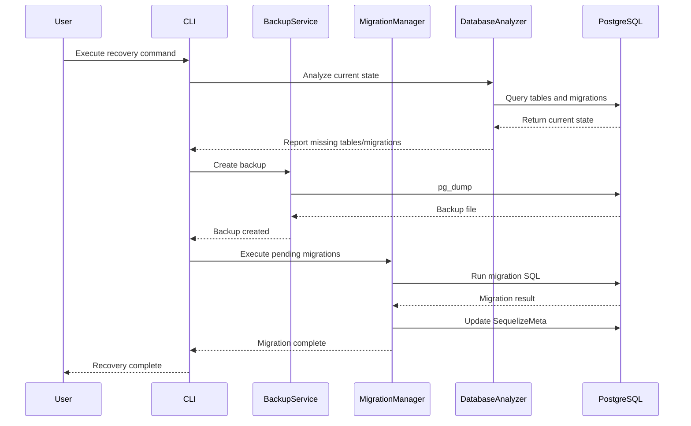

# Design Document: Database Recovery System

## Overview

O Database Recovery System é uma solução para recuperar e proteger a base de dados de desenvolvimento contra perda de dados. O sistema fornece ferramentas para:

1. Restaurar a base de dados a partir de backups
2. Analisar e executar migrações pendentes de forma segura
3. Criar backups automáticos antes de operações críticas
4. Prevenir operações perigosas na base de dados de desenvolvimento
5. Gerar relatórios sobre o estado da base de dados

O sistema é implementado como um conjunto de scripts CLI que podem ser executados manualmente ou integrados em hooks de desenvolvimento.

## Architecture

### High-Level Architecture

```
┌─────────────────────────────────────────────────────────────┐
│                     CLI Interface                            │
│  (db-recovery.js, db-migrate.js, db-status.js)             │
└────────────────────┬────────────────────────────────────────┘
                     │
┌────────────────────┴────────────────────────────────────────┐
│                  Core Services                               │
│  ┌──────────────┐  ┌──────────────┐  ┌──────────────┐     │
│  │   Backup     │  │  Migration   │  │   Database   │     │
│  │   Service    │  │   Manager    │  │   Analyzer   │     │
│  └──────────────┘  └──────────────┘  └──────────────┘     │
└────────────────────┬────────────────────────────────────────┘
                     │
┌────────────────────┴────────────────────────────────────────┐
│                  Database Layer                              │
│  ┌──────────────┐  ┌──────────────┐                        │
│  │  PostgreSQL  │  │ SequelizeMeta│                        │
│  │  (tatuticket)│  │   (tracking) │                        │
│  └──────────────┘  └──────────────┘                        │
└─────────────────────────────────────────────────────────────┘
```

### Component Interaction Flow



## Components and Interfaces

### 1. Database Analyzer

**Purpose:** Analisa o estado atual da base de dados e identifica problemas.

**Interface:**
```javascript
class DatabaseAnalyzer {
  /**
   * Analisa o estado atual da base de dados
   * @returns {Promise<DatabaseState>}
   */
  async analyzeDatabaseState();
  
  /**
   * Lista todas as tabelas existentes
   * @returns {Promise<string[]>}
   */
  async listTables();
  
  /**
   * Lista migrações executadas
   * @returns {Promise<string[]>}
   */
  async listExecutedMigrations();
  
  /**
   * Lista migrações disponíveis nos diretórios
   * @returns {Promise<MigrationFile[]>}
   */
  async listAvailableMigrations();
  
  /**
   * Identifica migrações pendentes
   * @returns {Promise<string[]>}
   */
  async findPendingMigrations();
  
  /**
   * Gera relatório de estado
   * @returns {Promise<StatusReport>}
   */
  async generateStatusReport();
}
```

**Types:**
```typescript
interface DatabaseState {
  tables: string[];
  executedMigrations: string[];
  availableMigrations: MigrationFile[];
  pendingMigrations: string[];
  missingTables: string[];
  hasIssues: boolean;
}

interface MigrationFile {
  name: string;
  path: string;
  type: 'sql' | 'js' | 'cjs';
  timestamp: string;
}

interface StatusReport {
  timestamp: string;
  databaseName: string;
  totalTables: number;
  executedMigrations: number;
  pendingMigrations: number;
  issues: Issue[];
}

interface Issue {
  severity: 'error' | 'warning' | 'info';
  message: string;
  details?: any;
}
```

### 2. Backup Service

**Purpose:** Gerencia backups da base de dados.

**Interface:**
```javascript
class BackupService {
  /**
   * Cria um backup da base de dados
   * @param {string} reason - Motivo do backup
   * @returns {Promise<BackupResult>}
   */
  async createBackup(reason);
  
  /**
   * Lista backups disponíveis
   * @returns {Promise<BackupInfo[]>}
   */
  async listBackups();
  
  /**
   * Restaura um backup
   * @param {string} backupPath - Caminho do backup
   * @returns {Promise<RestoreResult>}
   */
  async restoreBackup(backupPath);
  
  /**
   * Remove backups antigos (mantém últimos 5)
   * @returns {Promise<number>} - Número de backups removidos
   */
  async cleanOldBackups();
  
  /**
   * Verifica integridade de um backup
   * @param {string} backupPath
   * @returns {Promise<boolean>}
   */
  async verifyBackup(backupPath);
}
```

**Types:**
```typescript
interface BackupResult {
  success: boolean;
  backupPath: string;
  size: number;
  timestamp: string;
  error?: string;
}

interface BackupInfo {
  path: string;
  size: number;
  created: Date;
  reason?: string;
}

interface RestoreResult {
  success: boolean;
  tablesRestored: number;
  error?: string;
}
```

### 3. Migration Manager

**Purpose:** Executa migrações de forma segura com backup automático.

**Interface:**
```javascript
class MigrationManager {
  /**
   * Executa uma migração específica
   * @param {MigrationFile} migration
   * @returns {Promise<MigrationResult>}
   */
  async executeMigration(migration);
  
  /**
   * Executa todas as migrações pendentes
   * @param {boolean} dryRun - Se true, apenas simula
   * @returns {Promise<MigrationBatchResult>}
   */
  async executePendingMigrations(dryRun = false);
  
  /**
   * Reverte última migração
   * @returns {Promise<MigrationResult>}
   */
  async rollbackLastMigration();
  
  /**
   * Registra migração na SequelizeMeta
   * @param {string} migrationName
   * @returns {Promise<void>}
   */
  async recordMigration(migrationName);
  
  /**
   * Valida ordem de migrações
   * @returns {Promise<ValidationResult>}
   */
  async validateMigrationOrder();
}
```

**Types:**
```typescript
interface MigrationResult {
  success: boolean;
  migrationName: string;
  backupPath?: string;
  error?: string;
  duration: number;
}

interface MigrationBatchResult {
  totalMigrations: number;
  successfulMigrations: number;
  failedMigrations: number;
  results: MigrationResult[];
}

interface ValidationResult {
  valid: boolean;
  issues: string[];
}
```

### 4. Safety Guard

**Purpose:** Previne operações perigosas na base de dados de desenvolvimento.

**Interface:**
```javascript
class SafetyGuard {
  /**
   * Verifica se operação é segura
   * @param {string} operation - Nome da operação
   * @param {object} context - Contexto da operação
   * @returns {Promise<SafetyCheck>}
   */
  async checkOperation(operation, context);
  
  /**
   * Solicita confirmação do usuário
   * @param {string} message
   * @returns {Promise<boolean>}
   */
  async requestConfirmation(message);
  
  /**
   * Verifica se está em ambiente de teste
   * @returns {boolean}
   */
  isTestEnvironment();
  
  /**
   * Bloqueia operação perigosa
   * @param {string} reason
   * @throws {SafetyError}
   */
  blockOperation(reason);
}
```

**Types:**
```typescript
interface SafetyCheck {
  safe: boolean;
  requiresConfirmation: boolean;
  warnings: string[];
  blockers: string[];
}

class SafetyError extends Error {
  constructor(message: string, operation: string);
}
```

## Data Models

### Database Configuration

```javascript
const DatabaseConfig = {
  development: {
    host: process.env.POSTGRES_HOST,
    port: process.env.POSTGRES_PORT,
    database: process.env.POSTGRES_DB,
    user: process.env.POSTGRES_USER,
    password: process.env.POSTGRES_PASSWORD
  },
  test: {
    dialect: 'sqlite',
    storage: ':memory:'
  }
};
```

### Migration Directories

```javascript
const MigrationPaths = {
  sequelize: 'backend/src/migrations',
  sql: 'backend/migrations',
  backup: 'backend/backups'
};
```

## Correctness Properties

*A property is a characteristic or behavior that should hold true across all valid executions of a system—essentially, a formal statement about what the system should do. Properties serve as the bridge between human-readable specifications and machine-verifiable correctness guarantees.*

### Property 1: Missing Table Detection

*For any* database state with missing tables, the Database Analyzer must correctly identify all tables that are absent compared to the expected schema.

**Validates: Requirements 1.1**

### Property 2: Backup and Restore Round Trip

*For any* valid database state, creating a backup and then restoring it must produce an equivalent database state with all tables and data intact.

**Validates: Requirements 1.2, 5.2**

### Property 3: Backup Before Migration

*For any* migration execution, a backup must be created before the migration runs, and if the migration fails, the backup must be automatically restored.

**Validates: Requirements 3.1, 3.3**

### Property 4: Migration Registration

*For any* successfully executed migration, the migration name must be recorded in the SequelizeMeta table.

**Validates: Requirements 3.4**

### Property 5: Test Environment Isolation

*For any* test execution, the test must use a separate database (SQLite in memory or separate PostgreSQL test database) and any attempt to access the development database must be blocked with an error.

**Validates: Requirements 4.2, 4.3, 4.4**

### Property 6: Migration Order Consistency

*For any* set of pending migrations, they must be executed in chronological order based on their timestamp prefixes, and any ordering conflicts must be detected and reported.

**Validates: Requirements 2.4**

### Property 7: Backup Rotation

*For any* backup creation, if more than 5 backups exist after creation, the oldest backups must be automatically removed to maintain exactly 5 backups.

**Validates: Requirements 5.3**

### Property 8: Dangerous Operation Confirmation

*For any* dangerous operation (drop, sync force, restore), the system must require explicit user confirmation before proceeding, and without confirmation the operation must be cancelled.

**Validates: Requirements 4.1**

### Property 9: Backup Timestamp Uniqueness

*For any* backup created by the system, the backup filename must include a unique timestamp that allows chronological sorting and identification.

**Validates: Requirements 5.1**

### Property 10: Failed Backup Blocks Operation

*For any* critical operation that requires a backup, if the backup creation fails, the critical operation must be cancelled and an error must be reported.

**Validates: Requirements 5.4**

### Property 11: Status Report Completeness

*For any* status report generated, it must include all existing tables, all executed migrations, all pending migrations, and highlight any detected issues.

**Validates: Requirements 6.1, 6.2, 6.3, 6.4**

### Property 12: Pending Migration Detection

*For any* database state, the set of pending migrations must equal the set of available migrations minus the set of executed migrations (as recorded in SequelizeMeta).

**Validates: Requirements 2.1, 2.2, 2.3**

## Error Handling

### Error Categories

1. **Connection Errors**
   - Database unreachable
   - Authentication failure
   - Network timeout

2. **Migration Errors**
   - SQL syntax error
   - Constraint violation
   - Missing dependencies

3. **Backup Errors**
   - Insufficient disk space
   - Permission denied
   - Corrupted backup file

4. **Safety Errors**
   - Dangerous operation blocked
   - Test environment violation
   - Missing confirmation

### Error Handling Strategy

```javascript
class RecoveryError extends Error {
  constructor(message, category, details) {
    super(message);
    this.category = category;
    this.details = details;
    this.timestamp = new Date();
  }
}

// Error handling pattern
try {
  await operation();
} catch (error) {
  if (error instanceof RecoveryError) {
    // Log structured error
    logger.error({
      category: error.category,
      message: error.message,
      details: error.details,
      timestamp: error.timestamp
    });
    
    // Attempt recovery if possible
    if (error.category === 'migration') {
      await rollbackAndRestore();
    }
  }
  throw error;
}
```

### Rollback Strategy

When a migration fails:
1. Stop execution immediately
2. Restore from the pre-migration backup
3. Log the failure with full details
4. Report to user with actionable information

## Testing Strategy

### Unit Tests

**Focus Areas:**
- Database analyzer correctly identifies missing tables
- Backup service creates valid backup files
- Migration manager parses migration files correctly
- Safety guard blocks dangerous operations
- Error handling for each component

**Example Unit Tests:**
```javascript
describe('DatabaseAnalyzer', () => {
  it('should identify missing tables', async () => {
    const analyzer = new DatabaseAnalyzer();
    const state = await analyzer.analyzeDatabaseState();
    expect(state.missingTables).toBeInstanceOf(Array);
  });
  
  it('should list executed migrations', async () => {
    const analyzer = new DatabaseAnalyzer();
    const migrations = await analyzer.listExecutedMigrations();
    expect(migrations).toContain('20251101-create-base-tables.cjs');
  });
});

describe('BackupService', () => {
  it('should create backup with timestamp', async () => {
    const service = new BackupService();
    const result = await service.createBackup('test');
    expect(result.success).toBe(true);
    expect(result.backupPath).toMatch(/\d{8}_\d{6}/);
  });
  
  it('should verify backup integrity', async () => {
    const service = new BackupService();
    const backup = await service.createBackup('test');
    const valid = await service.verifyBackup(backup.backupPath);
    expect(valid).toBe(true);
  });
});
```

### Property-Based Tests

**Property Test Configuration:**
- Minimum 100 iterations per test
- Use appropriate generators for database states
- Test with various migration scenarios

**Example Property Tests:**
```javascript
describe('Property 1: Missing Table Detection', () => {
  it('should identify all missing tables', async () => {
    // Feature: database-recovery, Property 1
    
    await fc.assert(
      fc.asyncProperty(
        databaseStateGenerator(),
        async (dbState) => {
          const analyzer = new DatabaseAnalyzer();
          const result = await analyzer.analyzeDatabaseState();
          
          // All tables in expected schema but not in actual should be identified
          const expectedMissing = dbState.expectedTables.filter(
            t => !dbState.actualTables.includes(t)
          );
          
          expect(result.missingTables).toEqual(expectedMissing);
        }
      ),
      { numRuns: 100 }
    );
  });
});

describe('Property 2: Backup and Restore Round Trip', () => {
  it('should restore database to exact state after backup', async () => {
    // Feature: database-recovery, Property 2
    
    await fc.assert(
      fc.asyncProperty(
        databaseStateGenerator(),
        async (initialState) => {
          const backupService = new BackupService();
          
          // Create backup
          const backup = await backupService.createBackup('test');
          expect(backup.success).toBe(true);
          
          // Modify database
          await modifyDatabase();
          
          // Restore backup
          const restore = await backupService.restoreBackup(backup.backupPath);
          expect(restore.success).toBe(true);
          
          // Verify state matches initial
          const finalState = await getDatabaseState();
          expect(finalState).toEqual(initialState);
        }
      ),
      { numRuns: 100 }
    );
  });
});

describe('Property 3: Backup Before Migration', () => {
  it('should create backup before migration and restore on failure', async () => {
    // Feature: database-recovery, Property 3
    
    await fc.assert(
      fc.asyncProperty(
        migrationGenerator(),
        async (migration) => {
          const manager = new MigrationManager();
          const backupService = new BackupService();
          
          const initialBackupCount = (await backupService.listBackups()).length;
          const initialState = await getDatabaseState();
          
          try {
            await manager.executeMigration(migration);
          } catch (error) {
            // If migration failed, state should be restored
            const finalState = await getDatabaseState();
            expect(finalState).toEqual(initialState);
          }
          
          // Backup should have been created
          const finalBackupCount = (await backupService.listBackups()).length;
          expect(finalBackupCount).toBeGreaterThan(initialBackupCount);
        }
      ),
      { numRuns: 100 }
    );
  });
});

describe('Property 5: Test Environment Isolation', () => {
  it('should block development database access from tests', async () => {
    // Feature: database-recovery, Property 5
    
    await fc.assert(
      fc.asyncProperty(
        fc.constantFrom('test', 'testing', 'ci'),
        async (env) => {
          process.env.NODE_ENV = env;
          
          const guard = new SafetyGuard();
          const check = await guard.checkOperation('database_access', {
            database: 'tatuticket'
          });
          
          // Should block access to development database
          expect(check.safe).toBe(false);
          expect(check.blockers.length).toBeGreaterThan(0);
        }
      ),
      { numRuns: 100 }
    );
  });
});

describe('Property 7: Backup Rotation', () => {
  it('should maintain exactly 5 backups', async () => {
    // Feature: database-recovery, Property 7
    
    await fc.assert(
      fc.asyncProperty(
        fc.integer({ min: 6, max: 20 }),
        async (numBackups) => {
          const backupService = new BackupService();
          
          // Create multiple backups
          for (let i = 0; i < numBackups; i++) {
            await backupService.createBackup(`test-${i}`);
          }
          
          // Should have exactly 5 backups
          const backups = await backupService.listBackups();
          expect(backups.length).toBe(5);
          
          // Should keep the 5 most recent
          const timestamps = backups.map(b => b.created).sort();
          expect(timestamps).toEqual(timestamps.slice(-5));
        }
      ),
      { numRuns: 100 }
    );
  });
});

describe('Property 12: Pending Migration Detection', () => {
  it('should correctly identify pending migrations', async () => {
    // Feature: database-recovery, Property 12
    
    await fc.assert(
      fc.asyncProperty(
        migrationSetGenerator(),
        async (migrationSet) => {
          const analyzer = new DatabaseAnalyzer();
          
          const available = migrationSet.available;
          const executed = migrationSet.executed;
          const expectedPending = available.filter(m => !executed.includes(m));
          
          const pending = await analyzer.findPendingMigrations();
          
          expect(pending.sort()).toEqual(expectedPending.sort());
        }
      ),
      { numRuns: 100 }
    );
  });
});
```

### Integration Tests

**Scenarios:**
1. Full recovery from backup
2. Execute multiple pending migrations
3. Rollback after failed migration
4. Backup rotation (create 10 backups, verify only 5 remain)

### Manual Testing Checklist

- [ ] Restore database from backup
- [ ] Execute pending migrations
- [ ] Verify all tables exist after recovery
- [ ] Confirm dangerous operations require confirmation
- [ ] Test with corrupted backup file
- [ ] Test with invalid migration file

## Implementation Notes

### Technology Stack

- **Language:** JavaScript (Node.js)
- **Database:** PostgreSQL
- **ORM:** Sequelize
- **CLI Framework:** Commander.js
- **Testing:** Jest + fast-check (property-based testing)
- **Backup Tool:** pg_dump / pg_restore

### CLI Commands

```bash
# Analyze database state
npm run db:status

# Create manual backup
npm run db:backup

# Restore from backup
npm run db:restore <backup-file>

# Execute pending migrations
npm run db:migrate

# Rollback last migration
npm run db:rollback

# Full recovery (restore + migrate)
npm run db:recover
```

### Configuration

```javascript
// backend/src/config/recovery.js
export const RecoveryConfig = {
  backupDir: 'backend/backups',
  maxBackups: 5,
  migrationDirs: [
    'backend/src/migrations',
    'backend/migrations'
  ],
  safetyChecks: {
    requireConfirmation: ['drop', 'sync_force', 'restore'],
    blockInTest: ['development_db_access']
  }
};
```
