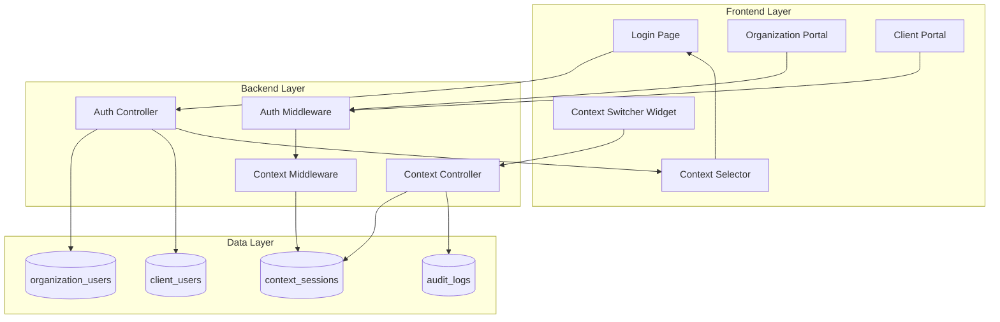
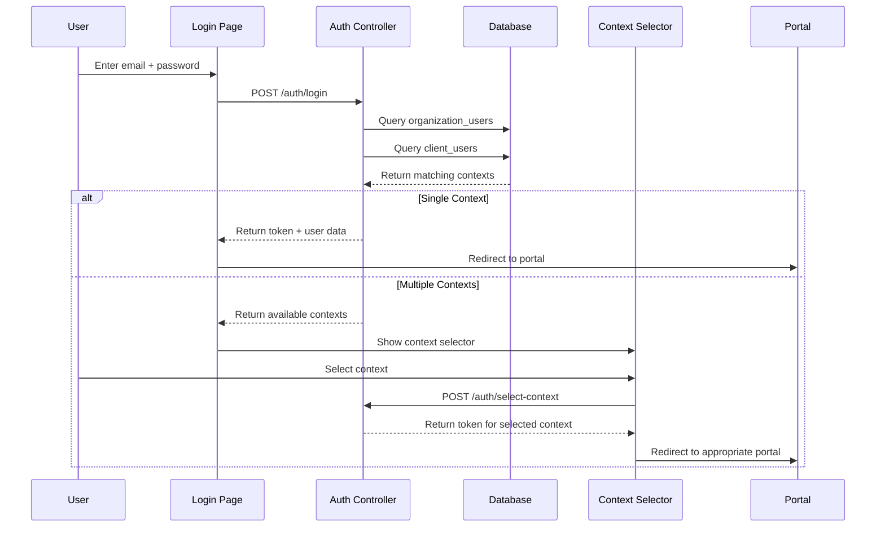
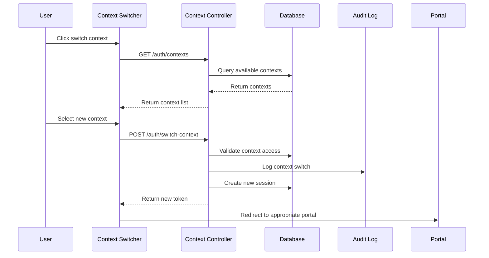

# Design Document: Multi-Organization Context Switching

## Overview

Este documento define o design técnico para implementar a funcionalidade de troca de contexto multi-organização, permitindo que usuários com o mesmo email possam trabalhar em múltiplas organizações e empresas clientes com diferentes roles e permissões, sem conflitos de autenticação.

### Problem Statement

Atualmente, o sistema possui suporte parcial para múltiplos contextos através das tabelas `organization_users` e `client_users`, mas não implementa:
- Seleção de contexto quando múltiplos contextos estão disponíveis para o mesmo email
- Troca de contexto durante sessão ativa sem logout
- Validação consistente de contexto em todas as APIs
- Interface de usuário para gestão de contextos
- Auditoria de trocas de contexto

### Goals

- Permitir que um email exista em múltiplas linhas em `organization_users` (diferentes organizações) e `client_users` (diferentes empresas clientes)
- Implementar seleção de contexto no login quando múltiplos contextos estão disponíveis
- Permitir troca de contexto durante sessão ativa
- Garantir isolamento completo de permissões entre contextos
- Implementar auditoria de todas as operações de contexto
- Manter compatibilidade com a estrutura existente de autenticação

### Non-Goals

- Migração de dados existentes (será tratado em migration plan separado)
- Suporte a contextos simultâneos (múltiplas sessões ativas)
- Federação de identidade entre organizações
- Single Sign-On (SSO) externo

## Architecture

### High-Level Architecture



### Authentication Flow



### Context Switching Flow



## Components and Interfaces

### Backend Components

#### 1. Auth Controller Extensions

**File**: `backend/src/modules/auth/authController.js`

Extensões necessárias:

```javascript
// Nova função: Retornar contextos disponíveis após validação de credenciais
export const getAvailableContexts = async (req, res, next) => {
  // Input: email, password
  // Output: Array de contextos disponíveis
  // Lógica: Validar credenciais em ambas as tabelas e retornar todos os contextos válidos
}

// Nova função: Selecionar contexto específico
export const selectContext = async (req, res, next) => {
  // Input: email, password, contextId, contextType
  // Output: token, user data
  // Lógica: Criar sessão para o contexto selecionado
}

// Nova função: Trocar contexto durante sessão ativa
export const switchContext = async (req, res, next) => {
  // Input: contextId, contextType (via authenticated request)
  // Output: novo token, user data
  // Lógica: Invalidar sessão atual, criar nova sessão para novo contexto
}

// Nova função: Listar contextos disponíveis para usuário autenticado
export const listUserContexts = async (req, res, next) => {
  // Input: user email (via token)
  // Output: Array de contextos disponíveis
  // Lógica: Buscar todos os contextos do email do usuário
}
```

#### 2. Context Service

**File**: `backend/src/services/contextService.js` (novo)

```javascript
class ContextService {
  // Buscar todos os contextos para um email
  async getContextsForEmail(email, password = null)
  
  // Validar se usuário tem acesso a um contexto específico
  async validateContextAccess(email, contextId, contextType)
  
  // Criar sessão de contexto
  async createContextSession(userId, userType, contextId, contextType)
  
  // Invalidar sessão de contexto
  async invalidateContextSession(sessionId)
  
  // Obter contexto ativo da sessão
  async getActiveContext(sessionId)
  
  // Registrar troca de contexto
  async logContextSwitch(userId, fromContext, toContext)
}
```

#### 3. Context Middleware

**File**: `backend/src/middleware/contextMiddleware.js` (novo)

```javascript
// Middleware para validar contexto em requisições
export const validateContext = async (req, res, next) => {
  // Extrair contexto do token
  // Validar que recursos acessados pertencem ao contexto ativo
  // Bloquear acesso se contexto não corresponder
}

// Middleware para injetar contexto em requisições
export const injectContext = async (req, res, next) => {
  // Adicionar informações de contexto ao objeto req
  // Disponibilizar para controllers
}
```

#### 4. Database Models

**Modificações em OrganizationUser**:
- Remover constraint `unique` do campo `email`
- Adicionar constraint `unique` composto `(email, organization_id)`
- Já implementado conforme código existente

**Modificações em ClientUser**:
- Remover constraint `unique` do campo `email`
- Adicionar constraint `unique` composto `(email, client_id)`

**Nova tabela: context_sessions**:

```javascript
// File: backend/src/models/ContextSession.js
{
  id: UUID (PK),
  userId: UUID,
  userType: ENUM('provider', 'organization', 'client'),
  contextId: UUID, // organization_id ou client_id
  contextType: ENUM('organization', 'client'),
  sessionToken: STRING,
  ipAddress: STRING,
  userAgent: STRING,
  isActive: BOOLEAN,
  lastActivityAt: TIMESTAMP,
  expiresAt: TIMESTAMP,
  createdAt: TIMESTAMP,
  updatedAt: TIMESTAMP
}
```

**Nova tabela: context_audit_logs**:

```javascript
// File: backend/src/models/ContextAuditLog.js
{
  id: UUID (PK),
  userId: UUID,
  userEmail: STRING,
  userType: ENUM('provider', 'organization', 'client'),
  action: ENUM('login', 'context_switch', 'logout'),
  fromContextId: UUID (nullable),
  fromContextType: ENUM('organization', 'client') (nullable),
  toContextId: UUID,
  toContextType: ENUM('organization', 'client'),
  ipAddress: STRING,
  userAgent: STRING,
  success: BOOLEAN,
  errorMessage: STRING (nullable),
  createdAt: TIMESTAMP
}
```

### Frontend Components

#### 1. Context Selector Component

**File**: `portalOrganizaçãoTenant/src/components/ContextSelector.jsx` (novo)
**File**: `portalClientEmpresa/src/components/ContextSelector.jsx` (novo)

```jsx
// Props:
// - contexts: Array de contextos disponíveis
// - onSelect: Callback quando contexto é selecionado
// - loading: Boolean

// Funcionalidade:
// - Exibir lista de contextos agrupados por tipo (Organization / Client)
// - Mostrar nome da organização/empresa, role do usuário
// - Destacar último contexto usado
// - Permitir seleção via click
```

#### 2. Context Switcher Widget

**File**: `portalOrganizaçãoTenant/src/components/ContextSwitcher.jsx` (novo)
**File**: `portalClientEmpresa/src/components/ContextSwitcher.jsx` (novo)

```jsx
// Props:
// - currentContext: Contexto ativo
// - onSwitch: Callback quando troca é solicitada

// Funcionalidade:
// - Exibir contexto atual no header/navbar
// - Dropdown com contextos disponíveis
// - Indicador visual do contexto ativo
// - Ação de troca de contexto
```

#### 3. Login Page Modifications

**Files**: 
- `portalOrganizaçãoTenant/src/pages/Login.jsx`
- `portalClientEmpresa/src/pages/Login.jsx`

Modificações:
- Após validação de credenciais, verificar se múltiplos contextos existem
- Se múltiplos contextos: exibir ContextSelector
- Se único contexto: proceder com login direto
- Armazenar contexto selecionado no token

### API Endpoints

#### Authentication Endpoints

```
POST /auth/login
Body: { email, password }
Response: 
  - Se único contexto: { token, user, context }
  - Se múltiplos contextos: { requiresContextSelection: true, contexts: [...] }

POST /auth/select-context
Body: { email, password, contextId, contextType }
Response: { token, user, context }

GET /auth/contexts
Headers: Authorization: Bearer <token>
Response: { contexts: [...] }

POST /auth/switch-context
Headers: Authorization: Bearer <token>
Body: { contextId, contextType }
Response: { token, user, context }

GET /auth/context/current
Headers: Authorization: Bearer <token>
Response: { context: {...} }
```

#### Context Management Endpoints

```
GET /contexts/history
Headers: Authorization: Bearer <token>
Query: { limit, offset }
Response: { switches: [...], pagination: {...} }

GET /contexts/audit
Headers: Authorization: Bearer <token>
Query: { startDate, endDate, action, limit, offset }
Response: { logs: [...], pagination: {...} }
```

### Session Management

#### Token Structure

```javascript
{
  userId: UUID,
  userType: 'organization' | 'client' | 'provider',
  email: STRING,
  contextId: UUID,
  contextType: 'organization' | 'client',
  organizationId: UUID,
  clientId: UUID (nullable),
  role: STRING,
  permissions: ARRAY,
  sessionId: UUID,
  iat: TIMESTAMP,
  exp: TIMESTAMP
}
```

#### Session Lifecycle

1. **Login**: Criar sessão com contexto selecionado
2. **Context Switch**: Invalidar sessão atual, criar nova sessão
3. **Logout**: Invalidar sessão
4. **Expiration**: Sessões expiram após período de inatividade
5. **Validation**: Cada requisição valida sessão e contexto

## Data Models

### Context Data Structure

```typescript
interface Context {
  id: string;
  type: 'organization' | 'client';
  organizationId: string;
  organizationName: string;
  clientId?: string;
  clientName?: string;
  userId: string;
  userEmail: string;
  role: string;
  permissions: string[];
  isLastUsed: boolean;
  lastAccessedAt: Date;
}
```

### Available Contexts Response

```typescript
interface AvailableContextsResponse {
  requiresContextSelection: boolean;
  contexts: Context[];
  lastUsedContext?: Context;
}
```

### Context Switch Request

```typescript
interface ContextSwitchRequest {
  contextId: string;
  contextType: 'organization' | 'client';
}
```

### Context Audit Log Entry

```typescript
interface ContextAuditLog {
  id: string;
  userId: string;
  userEmail: string;
  action: 'login' | 'context_switch' | 'logout';
  fromContext?: {
    id: string;
    type: 'organization' | 'client';
    name: string;
  };
  toContext: {
    id: string;
    type: 'organization' | 'client';
    name: string;
  };
  ipAddress: string;
  userAgent: string;
  timestamp: Date;
  success: boolean;
  errorMessage?: string;
}
```

