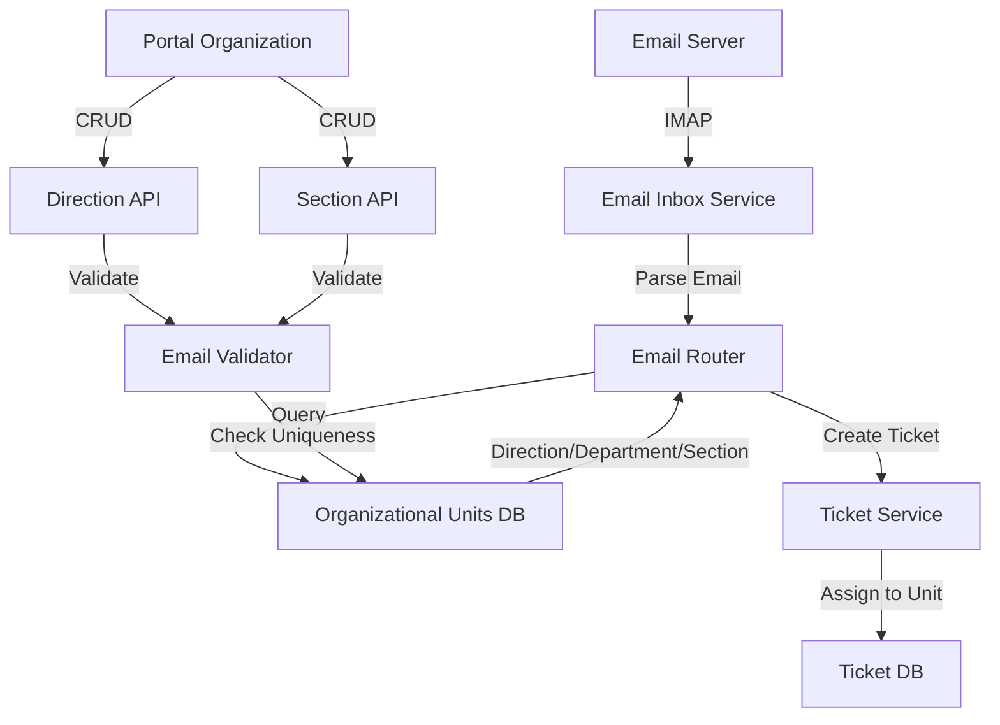

# Design Document: Organizational Email Routing

## Overview

This design document describes the implementation of email support for Directions and Sections in the organizational hierarchy. Currently, only Departments have email fields, but Directions and Sections also need this capability to enable automatic ticket creation and routing when emails are sent to their addresses.

The solution involves:
1. Adding email fields to Direction and Section database models
2. Implementing email uniqueness validation across all organizational units
3. Updating the email inbox service to route tickets based on organizational unit emails
4. Modifying frontend forms and lists to display and edit email fields
5. Updating API endpoints to handle the new email fields

## Architecture

### System Components



### Data Flow

1. **Email Reception**: Email server receives message → IMAP service fetches → Parser extracts data
2. **Routing**: Email Router queries database for matching organizational unit email
3. **Ticket Creation**: Ticket created with appropriate directionId/departmentId/sectionId
4. **Frontend Management**: Users configure emails via Portal Organization forms

## Components and Interfaces

### 1. Database Models

#### Direction Model Extension

```javascript
// backend/src/modules/directions/directionModel.js
{
  // ... existing fields ...
  email: {
    type: DataTypes.STRING(255),
    allowNull: true,
    validate: {
      isEmail: true
    },
    set(value) {
      if (value === '') {
        this.setDataValue('email', null);
      } else {
        this.setDataValue('email', value ? value.toLowerCase() : null);
      }
    }
  }
}
```

#### Section Model Extension

```javascript
// backend/src/modules/sections/sectionModel.js
{
  // ... existing fields ...
  email: {
    type: DataTypes.STRING(255),
    allowNull: true,
    validate: {
      isEmail: true
    },
    set(value) {
      if (value === '') {
        this.setDataValue('email', null);
      } else {
        this.setDataValue('email', value ? value.toLowerCase() : null);
      }
    }
  }
}
```

### 2. Email Validation Service

```javascript
// backend/src/services/emailValidationService.js

class EmailValidationService {
  /**
   * Validate email uniqueness across all organizational units
   * @param {string} email - Email to validate
   * @param {string} organizationId - Organization ID
   * @param {Object} excludeUnit - Unit to exclude from check (for updates)
   * @returns {Promise<{isValid: boolean, error?: string}>}
   */
  async validateEmailUniqueness(email, organizationId, excludeUnit = {}) {
    // Query Directions, Departments, and Sections
    // Return validation result
  }
}
```

### 3. Email Router Service

```javascript
// backend/src/services/emailRouterService.js

class EmailRouterService {
  /**
   * Find organizational unit by email address
   * @param {string} email - Destination email
   * @param {string} organizationId - Organization ID
   * @returns {Promise<{type: string, unit: Object}>}
   */
  async findOrganizationalUnitByEmail(email, organizationId) {
    // Search in order: Sections, Departments, Directions
    // Return {type: 'direction'|'department'|'section', unit: {...}}
  }
}
```

### 4. Updated Email Inbox Service

```javascript
// backend/src/services/emailInboxService.js

async createTicketFromEmail(fromEmail, subject, body, emailData) {
  // 1. Find user by email
  // 2. Extract destination email from emailData.to
  // 3. Use EmailRouterService to find organizational unit
  // 4. Create ticket with appropriate directionId/departmentId/sectionId
  // 5. Handle attachments
  // 6. Send confirmation email
}
```

### 5. API Controllers

#### Direction Controller Extension

```javascript
// backend/src/modules/directions/directionController.js

async create(req, res) {
  const { name, description, code, managerId, email } = req.body;
  
  // Validate email uniqueness if provided
  if (email) {
    const validation = await emailValidationService.validateEmailUniqueness(
      email,
      req.user.organizationId
    );
    if (!validation.isValid) {
      return res.status(400).json({ error: validation.error });
    }
  }
  
  // Create direction with email
}

async update(req, res) {
  const { email } = req.body;
  
  // Validate email uniqueness if changed
  if (email !== undefined) {
    const validation = await emailValidationService.validateEmailUniqueness(
      email,
      req.user.organizationId,
      { type: 'direction', id: req.params.id }
    );
    if (!validation.isValid) {
      return res.status(400).json({ error: validation.error });
    }
  }
  
  // Update direction
}
```

#### Section Controller Extension

Similar structure to Direction Controller.

### 6. Frontend Components

#### Direction Form Component

```jsx
// portalOrganizaçãoTenant/src/pages/Directions.jsx

<Form.Item
  label="Email"
  name="email"
  rules={[
    { type: 'email', message: 'Por favor, insira um email válido' }
  ]}
>
  <Input
    placeholder="direcao@exemplo.com"
    prefix={<MailOutlined />}
  />
</Form.Item>
```

#### Section Form Component

Similar structure to Direction Form.

#### List Columns

```jsx
{
  title: 'Email',
  dataIndex: 'email',
  key: 'email',
  render: (email) => email || <span style={{ color: '#999' }}>—</span>
}
```

## Data Models

### Database Schema Changes

#### Directions Table

```sql
ALTER TABLE directions
ADD COLUMN email VARCHAR(255) NULL,
ADD CONSTRAINT directions_email_check CHECK (email ~* '^[A-Za-z0-9._%+-]+@[A-Za-z0-9.-]+\.[A-Z|a-z]{2,}$');

CREATE INDEX idx_directions_email ON directions(email) WHERE email IS NOT NULL;
```

#### Sections Table

```sql
ALTER TABLE sections
ADD COLUMN email VARCHAR(255) NULL,
ADD CONSTRAINT sections_email_check CHECK (email ~* '^[A-Za-z0-9._%+-]+@[A-Za-z0-9.-]+\.[A-Z|a-z]{2,}$');

CREATE INDEX idx_sections_email ON sections(email) WHERE email IS NOT NULL;
```

### Email Routing Data Structure

```javascript
{
  destinationEmail: "suporte@exemplo.com",
  organizationalUnit: {
    type: "department", // or "direction" or "section"
    id: "uuid",
    name: "Departamento de TI",
    organizationId: "uuid"
  }
}
```

## Correctness Properties

*A property is a characteristic or behavior that should hold true across all valid executions of a system—essentially, a formal statement about what the system should do. Properties serve as the bridge between human-readable specifications and machine-verifiable correctness guarantees.*

### Property 1: Email Format Validation

*For any* Direction or Section, when an email is provided, it must match the standard email format (user@domain.tld).

**Validates: Requirements 1.4, 2.4**

### Property 2: Email Uniqueness Across Organization

*For any* organizational unit (Direction, Department, or Section) within the same organization, the email address must be unique across all three entity types.

**Validates: Requirements 3.1, 3.2**

### Property 3: Email Case Insensitivity

*For any* two organizational units with emails that differ only in case (e.g., "Support@example.com" vs "support@example.com"), the system must treat them as duplicates.

**Validates: Requirements 3.1**

### Property 4: Null Email Acceptance

*For any* organizational unit, setting the email to null or empty string must be accepted without validation errors.

**Validates: Requirements 1.5, 2.5, 3.4**

### Property 5: Email Routing Determinism

*For any* incoming email with a destination address, the email router must return exactly one organizational unit or null (never multiple matches).

**Validates: Requirements 5.1, 5.2**

### Property 6: Ticket Assignment Consistency

*For any* ticket created from an email, if an organizational unit is found, the ticket must have exactly one of directionId, departmentId, or sectionId set (not multiple).

**Validates: Requirements 4.1, 4.2, 4.3, 5.4**

### Property 7: Email Update Idempotence

*For any* organizational unit, updating its email to the same value it currently has must succeed without uniqueness validation errors.

**Validates: Requirements 3.3**

### Property 8: API Response Completeness

*For any* API response returning organizational units, if the unit has an email field in the database, it must be included in the response.

**Validates: Requirements 7.1, 7.4**

### Property 9: Frontend Form Validation

*For any* form submission with an invalid email format, the frontend must display a validation error before sending the request to the API.

**Validates: Requirements 8.5**

### Property 10: Backward Compatibility

*For any* existing Department with an email, after the migration, the email must remain unchanged and continue to function for ticket routing.

**Validates: Requirements 10.1, 10.2, 10.3**

## Error Handling

### Validation Errors

| Error Code | Description | HTTP Status | User Message |
|------------|-------------|-------------|--------------|
| `EMAIL_INVALID_FORMAT` | Email format is invalid | 400 | "Por favor, insira um email válido" |
| `EMAIL_ALREADY_EXISTS` | Email already used by another unit | 400 | "Este email já está associado a outra unidade organizacional" |
| `EMAIL_REQUIRED` | Email is required (if made mandatory) | 400 | "O campo email é obrigatório" |

### Routing Errors

| Error Code | Description | Action |
|------------|-------------|--------|
| `NO_UNIT_FOUND` | No organizational unit matches email | Create unassigned ticket or route to default queue |
| `MULTIPLE_UNITS_FOUND` | Multiple units have same email (should not happen) | Log error, use first match, alert admin |
| `USER_NOT_FOUND` | Sender email not registered | Log warning, optionally send registration email |

### Database Errors

| Error Code | Description | Action |
|------------|-------------|--------|
| `MIGRATION_FAILED` | Migration script failed | Rollback, log error, alert admin |
| `CONSTRAINT_VIOLATION` | Database constraint violated | Return 400 error with details |
| `CONNECTION_ERROR` | Database connection failed | Retry with exponential backoff |

## Testing Strategy

### Unit Tests

Unit tests will verify specific examples and edge cases:

1. **Email Validation**
   - Valid email formats (standard, with dots, with plus signs)
   - Invalid email formats (missing @, missing domain, special characters)
   - Empty string and null handling

2. **Email Uniqueness**
   - Duplicate detection across different entity types
   - Case-insensitive comparison
   - Update with same email (should succeed)

3. **Email Router**
   - Finding Direction by email
   - Finding Department by email
   - Finding Section by email
   - No match found scenario
   - Multiple matches scenario (error case)

4. **Ticket Creation**
   - Ticket created with directionId
   - Ticket created with departmentId
   - Ticket created with sectionId
   - Email metadata preserved

### Property-Based Tests

Property-based tests will verify universal properties across all inputs. Each test will run a minimum of 100 iterations with randomized inputs.

#### Test 1: Email Format Validation Property

**Feature: organizational-email-routing, Property 1: Email Format Validation**

Generate random strings and valid emails. Verify that:
- Valid emails are accepted
- Invalid formats are rejected
- Empty strings are converted to null

#### Test 2: Email Uniqueness Property

**Feature: organizational-email-routing, Property 2: Email Uniqueness Across Organization**

Generate random organizational units with emails. Verify that:
- No two units in the same organization can have the same email (case-insensitive)
- Units in different organizations can have the same email

#### Test 3: Email Case Insensitivity Property

**Feature: organizational-email-routing, Property 3: Email Case Insensitivity**

Generate random emails with varying case. Verify that:
- "Test@Example.com" and "test@example.com" are treated as duplicates
- Database stores emails in lowercase

#### Test 4: Null Email Acceptance Property

**Feature: organizational-email-routing, Property 4: Null Email Acceptance**

Generate random organizational units. Verify that:
- Setting email to null is always accepted
- Setting email to empty string converts to null
- Multiple units can have null emails

#### Test 5: Email Routing Determinism Property

**Feature: organizational-email-routing, Property 5: Email Routing Determinism**

Generate random organizational structures with emails. Verify that:
- Each email maps to exactly zero or one organizational unit
- Never returns multiple matches

#### Test 6: Ticket Assignment Consistency Property

**Feature: organizational-email-routing, Property 6: Ticket Assignment Consistency**

Generate random tickets from emails. Verify that:
- Each ticket has at most one of: directionId, departmentId, sectionId
- If organizational unit found, exactly one ID is set

#### Test 7: Email Update Idempotence Property

**Feature: organizational-email-routing, Property 7: Email Update Idempotence**

Generate random organizational units with emails. Verify that:
- Updating email to its current value always succeeds
- No uniqueness validation error occurs

#### Test 8: API Response Completeness Property

**Feature: organizational-email-routing, Property 8: API Response Completeness**

Generate random API requests for organizational units. Verify that:
- If database record has email, API response includes it
- Email field is present in response (even if null)

#### Test 9: Frontend Form Validation Property

**Feature: organizational-email-routing, Property 9: Frontend Form Validation**

Generate random form inputs. Verify that:
- Invalid emails trigger frontend validation before API call
- Valid emails pass frontend validation

#### Test 10: Backward Compatibility Property

**Feature: organizational-email-routing, Property 10: Backward Compatibility**

Generate random Department records with emails. Verify that:
- After migration, all Department emails remain unchanged
- Ticket routing to Departments continues to work

### Integration Tests

1. **End-to-End Email Flow**
   - Send email to Direction address → Verify ticket created with directionId
   - Send email to Department address → Verify ticket created with departmentId
   - Send email to Section address → Verify ticket created with sectionId

2. **Frontend-Backend Integration**
   - Create Direction with email via UI → Verify saved in database
   - Update Section email via UI → Verify updated in database
   - Attempt duplicate email via UI → Verify error displayed

3. **Migration Testing**
   - Run migration on test database → Verify schema changes
   - Verify existing data preserved → Verify indexes created

### Testing Framework

- **Unit Tests**: Jest
- **Property-Based Tests**: fast-check (JavaScript property testing library)
- **Integration Tests**: Supertest (API testing) + Playwright (UI testing)
- **Test Configuration**: Minimum 100 iterations per property test

## Implementation Notes

### Migration Strategy

1. Create migration file with email column additions
2. Add indexes for performance
3. Run migration in staging environment first
4. Verify no data loss
5. Deploy to production during maintenance window

### Performance Considerations

- Email lookups will use indexed queries
- Case-insensitive comparison handled at database level (lowercase storage)
- Email router caches organizational unit mappings (optional optimization)

### Security Considerations

- Email addresses stored in lowercase to prevent case-based attacks
- Email validation prevents SQL injection via email field
- IMAP credentials stored securely in environment variables
- Email content sanitized before storing in ticket description

### Backward Compatibility

- Existing Department email functionality unchanged
- Email router searches all three entity types
- API responses include email field for all organizational units
- Frontend gracefully handles missing email field (displays "—")
