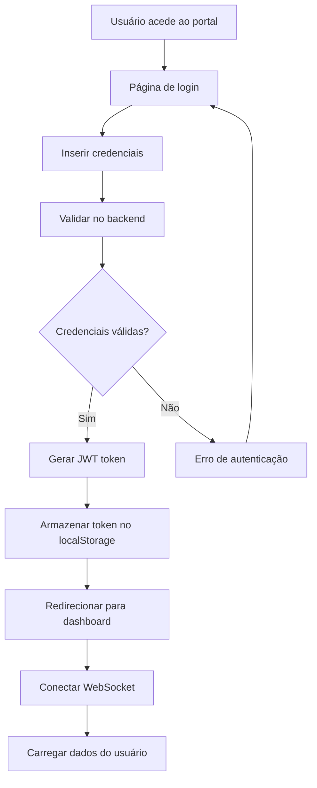
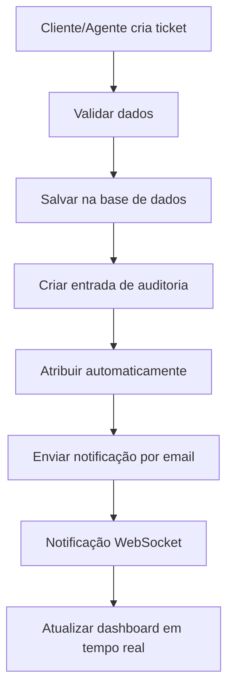
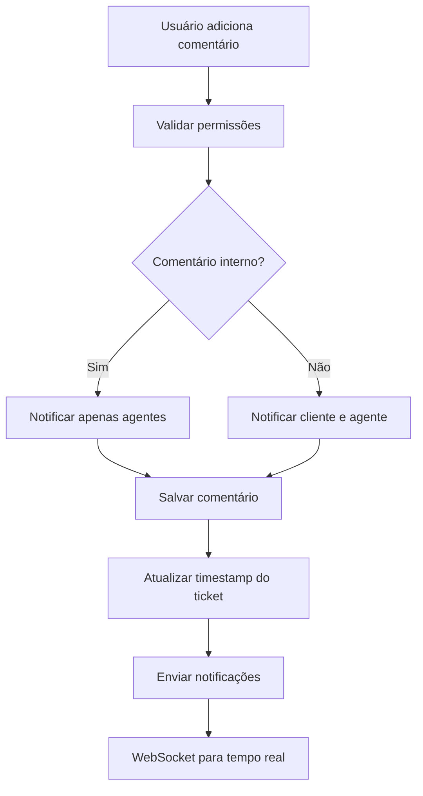
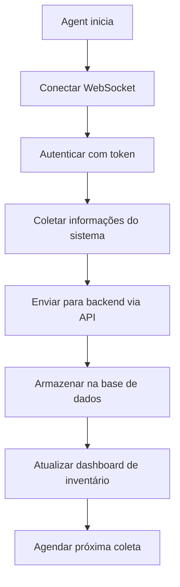

# 📊 Análise Completa do Projeto TatuTicket

## 🎯 Resumo Executivo

O **TatuTicket** é um sistema completo de gestão de tickets/helpdesk desenvolvido para organizações que necessitam de uma solução robusta e escalável para atendimento ao cliente. O projeto está em estado avançado de desenvolvimento (95% da Fase 1 concluída) e apresenta uma arquitetura moderna e bem estruturada.

### Objetivos Principais
- Sistema de tickets multi-tenant para organizações
- Portal de gestão para agentes e administradores
- Portal de autoatendimento para clientes
- Agente desktop para inventário e acesso remoto
- Integração com sistemas externos via API REST

---

## 🏗️ Arquitetura do Sistema

### Visão Geral da Arquitetura

```
┌─────────────────────────────────────────────────────────────┐
│                    TATUTICKET ECOSYSTEM                     │
├─────────────────────────────────────────────────────────────┤
│                                                             │
│  ┌─────────────────┐  ┌─────────────────┐  ┌─────────────┐ │
│  │   Portal Org    │  │ Portal Cliente  │  │ Desktop     │ │
│  │   (React)       │  │   (React)       │  │ Agent       │ │
│  │   Port: 5173    │  │   Port: 5174    │  │ (Electron)  │ │
│  └─────────────────┘  └─────────────────┘  └─────────────┘ │
│           │                     │                   │       │
│           └─────────────────────┼───────────────────┘       │
│                                 │                           │
│  ┌─────────────────────────────────────────────────────────┐ │
│  │                 Backend API (Node.js)                  │ │
│  │                    Port: 3000                          │ │
│  │  ┌─────────────┐ ┌─────────────┐ ┌─────────────────┐  │ │
│  │  │   REST API  │ │ WebSocket   │ │   File Upload   │  │ │
│  │  │   (Express) │ │ (Socket.io) │ │    (Multer)     │  │ │
│  │  └─────────────┘ └─────────────┘ └─────────────────┘  │ │
│  └─────────────────────────────────────────────────────────┘ │
│           │                     │                   │       │
│  ┌─────────────┐  ┌─────────────┐  ┌─────────────────────┐ │
│  │ PostgreSQL  │  │  MongoDB    │  │       Redis         │ │
│  │ (Dados      │  │ (Logs &     │  │   (Cache &          │ │
│  │ Principais) │  │ Auditoria)  │  │   Sessões)          │ │
│  │ Port: 5432  │  │ Port: 27017 │  │   Port: 6379        │ │
│  └─────────────┘  └─────────────┘  └─────────────────────┘ │
└─────────────────────────────────────────────────────────────┘
```

### Componentes Principais

#### 1. **Backend API (Node.js + Express)**
- **Localização**: `/backend/`
- **Porta**: 3000
- **Responsabilidades**:
  - API REST com 32+ endpoints
  - Autenticação JWT + Passport.js
  - WebSocket para tempo real (Socket.io)
  - Upload de arquivos
  - Logs e auditoria
  - Validação de dados (Joi)

#### 2. **Portal Organização (React)**
- **Localização**: `/portalOrganizaçãoTenant/`
- **Porta**: 5173 (dev) / 8080 (prod)
- **Usuários**: Administradores e Agentes
- **Funcionalidades**:
  - Dashboard com métricas
  - Gestão completa de tickets
  - Visualização Kanban
  - Gestão de clientes e usuários
  - Configurações do sistema

#### 3. **Portal Cliente (React)**
- **Localização**: `/portalClientEmpresa/`
- **Porta**: 5174 (dev) / 8081 (prod)
- **Usuários**: Clientes da organização
- **Funcionalidades**:
  - Abertura de tickets
  - Acompanhamento de solicitações
  - Base de conhecimento
  - Histórico de interações

#### 4. **Desktop Agent (Electron)**
- **Localização**: `/desktop-agent/`
- **Responsabilidades**:
  - Coleta de inventário automática
  - Acesso remoto seguro
  - Comunicação WebSocket com backend
  - Notificações desktop

---

## 💾 Modelo de Dados

### Base de Dados Principal (PostgreSQL)

```sql
-- Estrutura Simplificada das Tabelas Principais

Organizations
├── id (UUID, PK)
├── name, slug, logo
├── primaryColor, secondaryColor
└── settings (JSON)

Users
├── id (UUID, PK)
├── organizationId (FK)
├── name, email, password (bcrypt)
├── role (admin-org, agente, cliente-org)
└── isActive, lastLogin

Tickets
├── id (UUID, PK)
├── organizationId (FK)
├── requesterId, assigneeId (FK Users)
├── departmentId, categoryId (FK)
├── subject, description
├── status, priority
├── createdAt, updatedAt
└── resolvedAt, closedAt

Comments
├── id (UUID, PK)
├── ticketId (FK)
├── userId (FK)
├── message
├── isInternal
└── createdAt

Departments, Categories, SLAs, HoursBank...
```

### Base de Dados de Logs (MongoDB)

```javascript
// Collection: audit_logs
{
  _id: ObjectId,
  userId: UUID,
  organizationId: UUID,
  action: String,
  resource: String,
  resourceId: String,
  changes: Object,
  ipAddress: String,
  userAgent: String,
  timestamp: Date
}
```

---

## 🔧 Stack Tecnológica

### Backend
| Tecnologia | Versão | Propósito | Status |
|------------|--------|-----------|--------|
| **Node.js** | 18+ | Runtime JavaScript | ✅ 100% |
| **Express.js** | 4.18+ | Framework web | ✅ 100% |
| **PostgreSQL** | 15+ | Base de dados principal | ✅ 100% |
| **MongoDB** | 7+ | Logs e auditoria | ✅ 100% |
| **Redis** | 7+ | Cache e sessões | ✅ 100% |
| **Sequelize** | 6.35+ | ORM PostgreSQL | ✅ 100% |
| **Mongoose** | 8+ | ODM MongoDB | ✅ 100% |
| **Socket.io** | 4.8+ | WebSocket tempo real | ✅ 100% |
| **JWT + Passport** | - | Autenticação | ✅ 100% |
| **Bcrypt** | 2.4+ | Hash de senhas | ✅ 100% |
| **Joi** | 17+ | Validação de dados | ✅ 100% |
| **Winston** | 3+ | Sistema de logs | ✅ 100% |
| **Helmet** | 7+ | Segurança HTTP | ✅ 100% |
| **Multer** | 1.4+ | Upload de arquivos | ✅ 100% |

### Frontend (Ambos os Portais)
| Tecnologia | Versão | Propósito | Status |
|------------|--------|-----------|--------|
| **React** | 18.2+ | Framework UI | ✅ 100% |
| **Vite** | 5+ | Build tool | ✅ 100% |
| **Tailwind CSS** | 3.3+ | Framework CSS | ✅ 100% |
| **React Router** | 6.20+ | Roteamento | ✅ 100% |
| **Zustand** | 4.4+ | Gestão de estado | ✅ 100% |
| **Axios** | 1.6+ | Cliente HTTP | ✅ 100% |
| **React Hook Form** | 7.49+ | Formulários | ✅ 100% |
| **Lucide React** | 0.294+ | Ícones | ✅ 100% |
| **React Hot Toast** | 2.4+ | Notificações | ✅ 100% |
| **Socket.io Client** | 4.8+ | WebSocket cliente | ✅ 100% |
| **i18next** | 23+ | Internacionalização | ✅ 100% |
| **Recharts** | 2.10+ | Gráficos | ✅ 100% |

### Desktop Agent
| Tecnologia | Versão | Propósito | Status |
|------------|--------|-----------|--------|
| **Electron** | Latest | Framework desktop | ✅ 100% |
| **Socket.io Client** | 4.8+ | Comunicação tempo real | ✅ 100% |
| **systeminformation** | Latest | Coleta de inventário | ✅ 100% |
| **auto-launch** | Latest | Inicialização automática | ✅ 100% |

### DevOps
| Tecnologia | Propósito | Status |
|------------|-----------|--------|
| **Docker** | Containerização | ✅ 100% |
| **Docker Compose** | Orquestração | ✅ 100% |
| **Nginx** | Proxy reverso | ⏳ Planeado |

---

## 🔄 Fluxos de Trabalho Implementados

### 1. Fluxo de Autenticação



### 2. Fluxo de Criação de Ticket



### 3. Fluxo de Comentários



### 4. Fluxo de Inventário (Desktop Agent)



---

## 📈 Estado Atual do Desenvolvimento

### ✅ Completamente Implementado (95%)

#### Backend
- ✅ **Infraestrutura completa** (Express, PostgreSQL, MongoDB, Redis)
- ✅ **Autenticação e autorização** (JWT, Passport, RBAC)
- ✅ **Módulos principais**:
  - Tickets (CRUD, comentários, estatísticas)
  - Utilizadores e organizações
  - Departamentos e categorias
  - Bolsa de horas
  - Inventário de ativos
  - Auditoria completa
- ✅ **APIs REST** (32+ endpoints)
- ✅ **WebSocket** (Socket.io para tempo real)
- ✅ **Segurança** (Helmet, rate limiting, validação)
- ✅ **Logs estruturados** (Winston)
- ✅ **Upload de arquivos** (Multer)

#### Portal Organização
- ✅ **Interface completa** (React + Tailwind)
- ✅ **Páginas principais**:
  - Dashboard com métricas
  - Lista de tickets com filtros
  - Visualização Kanban
  - Detalhes de ticket com comentários
  - Gestão de clientes
  - Configurações
- ✅ **Funcionalidades avançadas**:
  - Temas claro/escuro
  - Internacionalização (PT/EN)
  - Notificações em tempo real
  - Export CSV/PDF
  - Responsividade completa

#### Portal Cliente
- ✅ **Interface de autoatendimento**
- ✅ **Funcionalidades**:
  - Abertura de tickets
  - Acompanhamento de solicitações
  - Histórico de interações
  - Base de conhecimento (estrutura)

#### Desktop Agent
- ✅ **Aplicação Electron funcional**
- ✅ **Coleta de inventário automática**
- ✅ **Comunicação WebSocket**
- ✅ **Acesso remoto básico**

### ⏳ Em Desenvolvimento/Planeado (5%)

#### Funcionalidades Pendentes
- **Base de conhecimento** (CRUD completo)
- **Notificações por email** (estrutura criada, configuração pendente)
- **Relatórios avançados** (estrutura básica implementada)
- **Testes automatizados** (estrutura configurada, testes pendentes)
- **CI/CD** (Docker pronto, pipeline pendente)

#### Melhorias Identificadas
- **Upload com preview** de imagens
- **Filtros avançados** nos tickets
- **Dashboard mais interativo**
- **Integração com sistemas externos**

---

## 🔗 Integrações e Dependências

### Integrações Implementadas
1. **PostgreSQL** - Dados principais
2. **MongoDB** - Logs e auditoria
3. **Redis** - Cache e sessões
4. **Socket.io** - Comunicação tempo real
5. **Email** - Notificações (estrutura pronta)

### Integrações Planeadas
1. **WhatsApp Business API** - Atendimento via WhatsApp
2. **Sistemas ERP** - Integração via API REST
3. **Active Directory** - Autenticação empresarial
4. **Slack/Teams** - Notificações para equipas

### Dependências Externas
- **Node.js 18+** (runtime)
- **PostgreSQL 15+** (base de dados)
- **MongoDB 7+** (logs)
- **Redis 7+** (cache)
- **Docker** (containerização)

---

## 💪 Pontos Fortes Identificados

### 1. **Arquitetura Robusta**
- ✅ Separação clara de responsabilidades
- ✅ Microserviços bem definidos
- ✅ Escalabilidade horizontal
- ✅ Padrões de design consistentes

### 2. **Segurança Enterprise**
- ✅ Autenticação JWT robusta
- ✅ Autorização baseada em roles (RBAC)
- ✅ Auditoria completa de ações
- ✅ Proteção contra ataques comuns (Helmet)
- ✅ Rate limiting implementado
- ✅ Validação rigorosa de dados

### 3. **Experiência do Utilizador**
- ✅ Interface moderna e intuitiva
- ✅ Responsividade completa
- ✅ Temas claro/escuro
- ✅ Internacionalização
- ✅ Notificações em tempo real
- ✅ Performance otimizada

### 4. **Qualidade do Código**
- ✅ Código bem estruturado e comentado
- ✅ Padrões de nomenclatura consistentes
- ✅ Modularização adequada
- ✅ Documentação abrangente
- ✅ Configuração de linting

### 5. **DevOps Ready**
- ✅ Docker e Docker Compose configurados
- ✅ Variáveis de ambiente bem definidas
- ✅ Logs estruturados
- ✅ Health checks implementados
- ✅ Pronto para CI/CD

---

## ⚠️ Pontos Fracos e Áreas de Melhoria

### 1. **Testes Automatizados**
- ❌ **Problema**: Ausência de testes unitários e de integração
- 🔧 **Solução**: Implementar Jest/Mocha para backend e React Testing Library para frontend
- 📊 **Impacto**: Alto - Essencial para manutenibilidade

### 2. **Monitorização e Observabilidade**
- ❌ **Problema**: Falta de métricas de performance e monitoring
- 🔧 **Solução**: Implementar Prometheus + Grafana ou similar
- 📊 **Impacto**: Médio - Importante para produção

### 3. **Documentação da API**
- ❌ **Problema**: Swagger/OpenAPI não totalmente implementado
- 🔧 **Solução**: Completar documentação automática da API
- 📊 **Impacto**: Médio - Facilita integração

### 4. **Backup e Recuperação**
- ❌ **Problema**: Estratégia de backup não definida
- 🔧 **Solução**: Implementar backup automático das bases de dados
- 📊 **Impacto**: Alto - Crítico para produção

### 5. **Performance**
- ⚠️ **Problema**: Algumas consultas podem ser otimizadas
- 🔧 **Solução**: Implementar índices adicionais e cache estratégico
- 📊 **Impacto**: Baixo - Otimização contínua

---

## 🎯 Recomendações Estratégicas

### Curto Prazo (1-2 semanas)
1. **Implementar testes automatizados** - Prioridade máxima
2. **Completar base de conhecimento** - Funcionalidade core
3. **Configurar notificações por email** - Experiência do utilizador
4. **Documentar API com Swagger** - Facilitar integrações

### Médio Prazo (1-2 meses)
1. **Implementar monitorização** - Observabilidade
2. **Otimizar performance** - Escalabilidade
3. **Adicionar integrações externas** - Valor de negócio
4. **Implementar CI/CD** - Automação

### Longo Prazo (3-6 meses)
1. **Expandir funcionalidades** - Relatórios avançados
2. **Mobile app** - Acesso móvel
3. **IA/ML** - Categorização automática
4. **Multi-tenancy avançado** - Escalabilidade

---

## 📊 Métricas de Sucesso Definidas

### Objetivos de Performance
- ✅ **40% redução** no tempo de resolução
- ✅ **60% satisfação** do cliente (CSAT)
- ✅ **50% autoatendimento** via base de conhecimento
- ✅ **99.9% uptime** do sistema

### Métricas Técnicas
- **Tempo de resposta API**: < 200ms (95% das requests)
- **Tempo de carregamento**: < 3s (primeira página)
- **Disponibilidade**: 99.9%
- **Cobertura de testes**: > 80%

---

## 🚀 Conclusão

O projeto **TatuTicket** apresenta uma base sólida e bem arquitetada, com 95% da funcionalidade core implementada. A qualidade do código, a arquitetura robusta e a experiência do utilizador são pontos fortes significativos.

### Estado Atual: **PRONTO PARA PRODUÇÃO BETA**

O sistema está suficientemente maduro para:
- ✅ Demonstrações para clientes
- ✅ Testes de aceitação do utilizador (UAT)
- ✅ Deploy em ambiente de staging
- ✅ Piloto com clientes selecionados

### Próximos Passos Críticos:
1. **Implementar testes automatizados**
2. **Configurar monitorização**
3. **Definir estratégia de backup**
4. **Preparar ambiente de produção**

O projeto demonstra excelente qualidade técnica e está bem posicionado para se tornar uma solução competitiva no mercado de sistemas de helpdesk.

---

**Documento gerado em**: Outubro 2025  
**Versão**: 1.0  
**Autor**: Análise Técnica TatuTicket