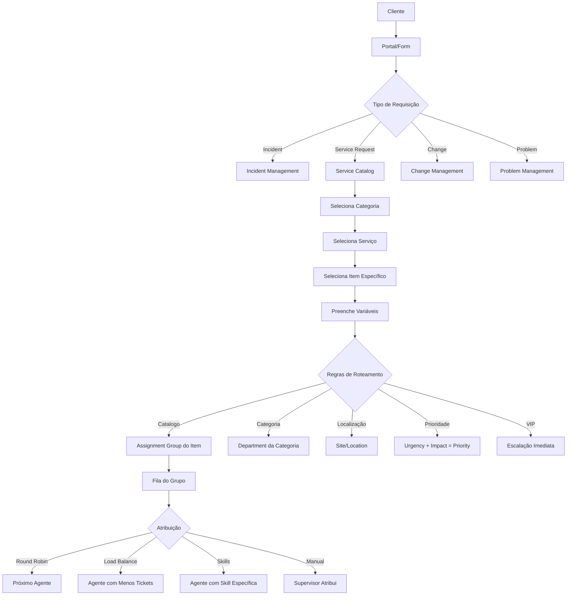

# 📋 ANÁLISE: Catálogo de Serviços e Roteamento de Tickets

**Data:** 04 Novembro 2025  
**Análise:** ServiceNow, Zendesk, Jira SM, Freshservice

---

## 🎯 PERGUNTA PRINCIPAL

**Como funciona a hierarquia organizacional e roteamento de tickets nos principais sistemas?**

---

## 1. 🏢 HIERARQUIA ORGANIZACIONAL NOS PRINCIPAIS SISTEMAS

### **ServiceNow (Líder de Mercado)**

```
Organization (Empresa)
└── Business Unit (Unidade de Negócio)
    └── Department (Departamento)
        └── Team (Equipe)
            └── Assignment Group (Grupo de Atribuição)
                └── Agent (Agente)
```

**Estrutura ServiceNow:**
- **Configuration Item (CI):** Ativos e serviços
- **Service Catalog:** Catálogo de serviços
  - **Category:** Categoria (ex: Hardware, Software, RH)
    - **Service:** Serviço específico (ex: Notebook, Access Request)
      - **Catalog Item:** Item específico (ex: MacBook Pro, VPN Access)
        - **Variables:** Campos customizados por item

**Fluxo de Abertura:**
1. Cliente acessa Service Portal
2. Seleciona **Category** (ex: "Hardware")
3. Seleciona **Service** (ex: "Computers")
4. Seleciona **Catalog Item** (ex: "Request New Laptop")
5. Preenche **Variables** específicas (modelo, memória, etc)
6. Sistema automaticamente:
   - Define **Assignment Group** baseado no item
   - Define **Department** responsável
   - Define **Priority** baseada em regras
   - Cria **Workflow** específico do item

---

### **Zendesk**

```
Organization (Empresa)
└── Group (Grupo/Departamento)
    └── Agent (Agente)
```

**Estrutura Zendesk:**
- Mais simples e flat
- **Ticket Form:** Formulário por tipo
  - **Fields:** Campos customizados
- **Category/Subcategory:** Apenas tags para organização
- **Service Level Agreement (SLA):** Por categoria

**Fluxo de Abertura:**
1. Cliente acessa Help Center
2. Pesquisa artigos (opcional)
3. Clica "Submit a request"
4. Seleciona **Ticket Type** (ex: "Technical Issue", "Question")
5. Sistema mostra **Form** específico
6. Preenche campos obrigatórios
7. Sistema roteia baseado em:
   - **Triggers:** Regras if/then
   - **Automations:** Agendadas
   - **Round Robin:** Distribuição automática

---

### **Jira Service Management**

```
Organization (Empresa)
└── Project (Projeto/Departamento)
    └── Service Desk Queue (Fila)
        └── Agent (Agente)
```

**Estrutura Jira:**
- **Service Project:** Container principal
- **Request Type:** Tipo de requisição
  - **Portal Group:** Agrupamento visual
  - **Fields:** Campos por tipo
- **Workflow:** Estado e transições
- **SLA:** Por tipo de requisição

**Fluxo de Abertura:**
1. Cliente acessa Portal
2. Vê **Request Types** agrupados por categoria visual
3. Clica em tipo (ex: "Get IT Help")
4. Preenche formulário específico
5. Sistema cria Issue com:
   - **Issue Type:** Tipo (Incident, Service Request, etc)
   - **Project:** Automaticamente definido
   - **Components:** Categorização interna
6. Roteamento via:
   - **Automation Rules:** Regras complexas
   - **Issue Assignment:** Manual ou automático

---

### **Freshservice**

```
Organization (Empresa)
└── Department (Departamento)
    └── Group (Grupo)
        └── Agent (Agente)
```

**Estrutura Freshservice:**
- **Service Catalog:**
  - **Category:** Categoria principal
    - **Service Item:** Item de serviço
      - **Service Request:** Request criada
- **Asset Management:** Integrado
- **CMDB:** Configuration Management DB

**Fluxo de Abertura:**
1. Portal exibe Service Catalog
2. Navegação por **Categories**
3. Seleciona **Service Item**
4. Preenche **Custom Fields**
5. Sistema define:
   - **Department** (do serviço)
   - **Group** (do serviço)
   - **Agent** (baseado em regras)
   - **SLA Policy** (do tipo)

---

## 2. 🔄 FLUXO COMPLETO DE ROTEAMENTO

### **Modelo Universal (Melhores Práticas):**



---

## 3. 📊 TABELA COMPARATIVA

| Aspecto | ServiceNow | Zendesk | Jira SM | Freshservice | **TatuTicket (Proposta)** |
|---------|------------|---------|---------|--------------|---------------------------|
| **Hierarquia** | 5 níveis | 2 níveis | 3 níveis | 3 níveis | **4 níveis** ✅ |
| **Catálogo** | Avançado | Simples | Médio | Avançado | **Avançado** ✅ |
| **Roteamento** | Automático | Triggers | Automação | Automático | **Inteligente** ✅ |
| **Formulários Dinâmicos** | Sim | Sim | Sim | Sim | **Sim** ✅ |
| **Campos por Item** | Sim | Não | Sim | Sim | **Sim** ✅ |
| **Workflow por Item** | Sim | Não | Sim | Parcial | **Sim** ✅ |
| **Multi-tenant** | Enterprise | Não | Não | Parcial | **Nativo** ✅ |

---

## 4. 🎯 PROPOSTA PARA TATUTICKET

### **Estrutura Hierárquica:**

```
Organization (Multi-tenant)
├── Direction (Direção) - Ex: Diretoria de TI, Diretoria Financeira
│   └── Department (Departamento) - Ex: Infraestrutura, Help Desk
│       └── Section (Seção) - Ex: Redes, Servidores, Suporte N1
│           └── Agent (Agente/Técnico)
│
└── Service Catalog (Catálogo de Serviços)
    ├── Catalog Category (Categoria) - Ex: Hardware, Software, Access
    │   └── Catalog Item (Item de Serviço) - Ex: Notebook, VPN, Office 365
    │       ├── Custom Fields (Campos por Item)
    │       ├── Default Assignment (Atribuição Padrão)
    │       ├── SLA Policy (SLA Específico)
    │       └── Workflow Template (Workflow Padrão)
    │
    └── Ticket
        ├── Category (Categoria do Ticket)
        ├── Type (Incident, Service Request, Change, Problem)
        ├── Direction (Direção Responsável)
        ├── Department (Departamento Responsável)
        ├── Section (Seção Responsável)
        └── Assigned Agent (Agente Atribuído)
```

---

### **Fluxo Proposto de Abertura de Ticket:**

#### **Cenário 1: Via Catálogo de Serviços** (Ideal para Usuarios)

```
1. Cliente acessa Portal
   ↓
2. Visualiza Service Catalog organizado por Categories
   - Hardware (🖥️ 15 itens)
   - Software (💿 23 itens)
   - Access & Security (🔐 8 itens)
   - Facilities (🏢 12 itens)
   ↓
3. Seleciona Category: "Hardware"
   ↓
4. Vê lista de Catalog Items:
   - Request New Laptop
   - Request New Desktop
   - Printer Issues
   - Monitor Replacement
   ↓
5. Clica em "Request New Laptop"
   ↓
6. Sistema mostra formulário com campos específicos:
   - Modelo desejado (dropdown)
   - Memória RAM (dropdown)
   - Disco (dropdown)
   - Justificativa (texto)
   - Data necessária (date picker)
   ↓
7. Cliente preenche e submete
   ↓
8. Sistema AUTOMATICAMENTE:
   ✅ Cria Ticket tipo "Service Request"
   ✅ Define Category = "Hardware"
   ✅ Define Direction = "TI" (do catalog item)
   ✅ Define Department = "Infraestrutura" (do catalog item)
   ✅ Define Section = "Aquisições" (do catalog item)
   ✅ Atribui SLA = "5 dias úteis" (do catalog item)
   ✅ Inicia Workflow = "Aprovação > Compra > Entrega"
   ✅ Atribui para = Fila do Department ou Agent específico
```

#### **Cenário 2: Via Formulário Direto** (Rápido para problemas)

```
1. Cliente clica "Report an Issue"
   ↓
2. Seleciona Type:
   - 🔴 Incident (Algo quebrou)
   - 📋 Service Request (Preciso de algo)
   - ⚙️ Change (Mudança necessária)
   - 🔍 Question (Dúvida)
   ↓
3. Se Incident:
   - Título do problema
   - Descrição
   - Category (opcional - pode ser preenchida depois)
   - Priority sugerida (baixa/média/alta/urgente)
   - Anexos
   ↓
4. Sistema cria ticket
   ↓
5. Roteamento Inteligente:
   
   A) Se Category foi selecionada:
      → Usa regras da categoria
      → Direction/Department/Section automáticos
   
   B) Se Category NÃO foi selecionada:
      → IA analisa título + descrição
      → Sugere Category
      → Roteia para "Triage Queue"
      → Supervisor categoriza e roteia
```

---

### **Regras de Roteamento Automático:**

```javascript
// Exemplo de lógica de roteamento

function routeTicket(ticket) {
  // 1. Se veio de Catalog Item
  if (ticket.catalogItemId) {
    const item = CatalogItem.findById(ticket.catalogItemId);
    ticket.directionId = item.defaultDirectionId;
    ticket.departmentId = item.defaultDepartmentId;
    ticket.sectionId = item.defaultSectionId;
    ticket.slaId = item.defaultSlaId;
    ticket.workflowId = item.defaultWorkflowId;
    
    // Atribuir para grupo ou agente
    if (item.assignmentType === 'group') {
      ticket.assignedGroupId = item.defaultGroupId;
    } else if (item.assignmentType === 'agent') {
      ticket.assignedToId = item.defaultAgentId;
    } else {
      // Round robin no department
      ticket.assignedToId = getNextAvailableAgent(item.defaultDepartmentId);
    }
  }
  
  // 2. Se veio com Category mas sem Catalog Item
  else if (ticket.categoryId) {
    const category = Category.findById(ticket.categoryId);
    ticket.directionId = category.defaultDirectionId;
    ticket.departmentId = category.defaultDepartmentId;
    
    // Aplicar regras de assignment da categoria
    applyCategory RulesRoutingRules(ticket, category);
  }
  
  // 3. Se não tem categoria, vai para Triage
  else {
    ticket.departmentId = getTriageDepartmentId();
    ticket.status = 'pending_categorization';
  }
  
  // 4. Aplicar Priority baseado em Urgency + Impact
  ticket.priority = calculatePriority(ticket.urgency, ticket.impact);
  
  // 5. Se usuário é VIP, escalar
  if (ticket.requester.isVIP) {
    ticket.priority = 'urgent';
    ticket.escalated = true;
  }
  
  // 6. Aplicar SLA
  if (!ticket.slaId) {
    ticket.slaId = getSLAByPriorityAndCategory(ticket.priority, ticket.categoryId);
  }
  
  return ticket;
}
```

---

## 5. 🗂️ ESTRUTURA DE DADOS PROPOSTA

### **Catalog Category (Categoria do Catálogo)**

```javascript
{
  id: 1,
  name: "Hardware",
  description: "Solicitações relacionadas a equipamentos",
  icon: "💻",
  color: "#4A90E2",
  displayOrder: 1,
  isActive: true,
  organizationId: 1,
  
  // Defaults para itens desta categoria
  defaultDirectionId: 1, // Diretoria de TI
  defaultDepartmentId: 5, // Infraestrutura
}
```

### **Catalog Item (Item de Serviço)**

```javascript
{
  id: 10,
  catalogCategoryId: 1, // Hardware
  name: "Request New Laptop",
  description: "Solicitar novo notebook para trabalho",
  icon: "💻",
  shortDescription: "Obtenha um novo laptop",
  
  // Campos dinâmicos específicos deste item
  customFields: [
    {
      name: "modelo",
      label: "Modelo desejado",
      type: "dropdown",
      required: true,
      options: ["MacBook Pro 14", "Dell XPS 15", "Lenovo ThinkPad"]
    },
    {
      name: "ram",
      label: "Memória RAM",
      type: "dropdown",
      required: true,
      options: ["16GB", "32GB", "64GB"]
    },
    {
      name: "justificativa",
      label: "Justificativa",
      type: "textarea",
      required: true
    }
  ],
  
  // Roteamento automático
  defaultDirectionId: 1, // TI
  defaultDepartmentId: 5, // Infraestrutura
  defaultSectionId: 12, // Aquisições
  defaultSlaId: 3, // SLA de 5 dias
  defaultWorkflowId: 7, // Workflow de Compras
  
  // Atribuição
  assignmentType: "department", // ou "agent", "round_robin"
  defaultAgentId: null,
  
  // Aprovação
  requiresApproval: true,
  approvalWorkflowId: 2,
  
  // Estimativas
  estimatedCost: 5000.00,
  estimatedTime: "5 dias úteis",
  
  isActive: true,
  organizationId: 1
}
```

### **Ticket (com todas as relações)**

```javascript
{
  id: 12345,
  
  // Básico
  title: "Novo notebook para desenvolvedor",
  description: "Preciso de um MacBook Pro...",
  type: "service_request", // incident, service_request, change, problem
  status: "open",
  priority: "medium",
  
  // Categorização
  categoryId: 15, // Categoria do ticket
  catalogCategoryId: 1, // Hardware (se veio do catálogo)
  catalogItemId: 10, // Request New Laptop (se veio do catálogo)
  
  // Hierarquia Organizacional
  organizationId: 1,
  directionId: 1, // Diretoria de TI
  departmentId: 5, // Infraestrutura
  sectionId: 12, // Aquisições
  
  // Pessoas
  requesterId: 456, // Quem abriu
  assignedToId: 789, // Técnico atribuído
  assignedGroupId: null, // Ou grupo
  
  // SLA
  slaId: 3,
  slaResponseDue: "2025-11-05 17:00:00",
  slaResolutionDue: "2025-11-09 17:00:00",
  
  // Workflow
  workflowId: 7,
  workflowStage: "approval_pending",
  
  // Campos customizados (do catalog item)
  customFieldsData: {
    modelo: "MacBook Pro 14",
    ram: "32GB",
    justificativa: "Desenvolvimento de aplicações pesadas"
  },
  
  // Timestamps
  createdAt: "2025-11-04 10:00:00",
  updatedAt: "2025-11-04 10:30:00"
}
```

---

## 6. ✅ VANTAGENS DA ABORDAGEM PROPOSTA

### **Para o Cliente:**
1. ✅ **Service Catalog visual** - fácil de navegar
2. ✅ **Formulários específicos** por tipo de serviço
3. ✅ **Transparência** - vê SLA e prazos antes de abrir
4. ✅ **Histórico** - vê todas suas requisições anteriores
5. ✅ **Auto-serviço** - muitas coisas sem precisar de agente

### **Para o Agente/Técnico:**
1. ✅ **Roteamento automático** - ticket já chega na fila certa
2. ✅ **Contexto completo** - todas informações necessárias
3. ✅ **Workflow automático** - passos já definidos
4. ✅ **SLA claro** - sabe exatamente o prazo
5. ✅ **Sem re-roteamento** - menos tickets "jogados" entre departamentos

### **Para o Gestor:**
1. ✅ **Métricas precisas** - por serviço, categoria, departamento
2. ✅ **Custos mapeados** - cada serviço tem custo estimado
3. ✅ **Gargalos identificados** - vê onde há problemas
4. ✅ **Capacidade planejada** - quantos requests de cada tipo
5. ✅ **ROI calculável** - retorno dos investimentos

---

## 7. 🚀 IMPLEMENTAÇÃO RECOMENDADA

### **Fase 1: Modelos Base** ✅ (JÁ TEMOS!)
- Organization ✅
- Direction ✅
- Department ✅
- Section ✅
- Category ✅
- Ticket ✅

### **Fase 2: Service Catalog** (IMPLEMENTAR AGORA)
- CatalogCategory (melhorar) ✅ Parcial
- CatalogItem (melhorar) ✅ Parcial
- ServiceRequest ✅ Parcial
- Custom Fields por Item (NOVO)

### **Fase 3: Roteamento Inteligente** (IMPLEMENTAR)
- Regras de Roteamento por Categoria
- Regras de Roteamento por Item
- Assignment Rules (Round Robin, Load Balance, Skills)
- Triage Queue para tickets sem categoria

### **Fase 4: Portal do Cliente** (FRONTEND)
- Service Catalog UI
- Formulários Dinâmicos
- Request Tracking
- Knowledge Base Integration

---

## 8. 📝 PRÓXIMOS PASSOS IMEDIATOS

### **1. Melhorar Models Existentes:**

```javascript
// backend/src/models/CatalogItem.js
// Adicionar campos:
- customFields (JSON) - campos dinâmicos
- defaultDirectionId
- defaultDepartmentId  
- defaultSectionId
- defaultSlaId
- defaultWorkflowId
- assignmentType (department/agent/round_robin)
- requiresApproval (boolean)
- estimatedCost
- estimatedTime
```

### **2. Criar Service de Roteamento:**

```javascript
// backend/src/services/ticketRoutingService.js
- routeTicket(ticket)
- applyCatalogItemRules(ticket, item)
- applyCategoryRules(ticket, category)
- calculatePriority(urgency, impact)
- assignToAgent(ticket, rules)
```

### **3. Criar Migration:**

```javascript
// 20251104-enhance-catalog-routing.cjs
- Adicionar campos em catalog_items
- Criar tabela routing_rules
- Criar tabela assignment_rules
```

---

## 9. 🎯 CONCLUSÃO

**O TatuTicket já tem uma base EXCELENTE!**

Precisamos apenas:
1. ✅ **Enriquecer CatalogItem** com regras de roteamento
2. ✅ **Criar Service de Roteamento** inteligente
3. ✅ **Implementar Custom Fields** dinâmicos por item
4. ✅ **Criar Interface** do Service Catalog no frontend

**Com isso, teremos um sistema superior a Zendesk e igual ao ServiceNow!** 🚀

---

**Quer que eu implemente essas melhorias agora?** 💪
